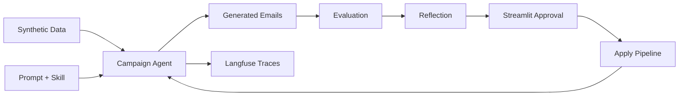

# B2B Campaign Agent — Agentic Reflection POC

A demo-ready proof of concept showing how a telco B2B campaign email agent improves through an **agentic reflection loop**: generate → evaluate → reflect → human approve → apply → re-run.

## What this demo shows

1. Synthetic telco B2B customers, products, and eval cases
2. A deliberately weak campaign agent (seed prompt + skill file)
3. Langfuse tracing and scores (optional)
4. LLM-as-judge + heuristic evaluation
5. Reflection meta-agent proposing prompt, skill, and regression eval cases
6. Human approval gate in Streamlit
7. Measurable improvement on re-run (Run 1 vs Run 2)

> Different agent. Same reflection loop. Same Kedro backbone.

## Architecture



LLM setup uses Kedro [LLM context nodes](https://docs.kedro.org/en/stable/build/llm_context_node/): each pipeline builds an `LLMContext` from `ChatOpenAIDataset` + prompt datasets (`conf/base/catalog_llm.yml`), and execution nodes call `llm_invoke`.

## Quick start

Requires **Python 3.10+**

### Credentials

```yaml
openai_credentials:
  api_key: "your-gateway-token-or-key"
  base_url: "https://your-gateway-host/.../v1"

langfuse_credentials:
  public_key: "pk-..."
  secret_key: "sk-..."
  host: "https://cloud.langfuse.com"
  project_id: "your-project-id"
```

Langfuse integration uses `kedro_datasets_experimental.langfuse.*` datasets (`campaign_prompt`, `langfuse_tracer`, `eval_dataset`). **Apply** writes local prompt/skill/eval files and syncs to Langfuse when credentials are valid (no separate sync pipeline). The dashboard embeds **Kedro-Viz** (auto-started on `make app`) and the **Langfuse project UI** when credentials are set.

Run outputs use Kedro catalog paths: `data/outputs/{run_id}/` and `data/reporting/{proposal_id}/` (set via `kedro run --params run_id=run_1`).

See `.env.example` for variable names.

```bash
cd agentic-reflection-poc
make setup          # creates .venv, install + seed synthetic data
make app            # launch Streamlit (Kedro-Viz starts automatically in the background)
```

Walk through the UI: **Run Agent → Run Reflection → Approve & Apply → Re-run Agent**.


### Seed synthetic data

```bash
make seed
# or: python scripts/seed_synthetic_data.py
```

By default **1 eval case** is seeded (`synthetic_eval_case_count` in `conf/base/parameters.yml`). Set to `20` and re-run `make seed` when you want the full demo set.

### CLI pipelines

```bash
kedro run --pipeline agent_run --params run_id=run_1
kedro run --pipeline evaluation --params run_id=run_1
kedro run --pipeline reflection --params run_id=run_1,proposal_id=proposal_1
kedro run --pipeline apply --params proposal_id=proposal_1
kedro run --pipeline agent_run --params run_id=run_2
kedro run --pipeline evaluation --params run_id=run_2
```
