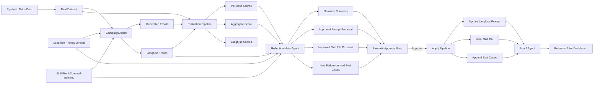
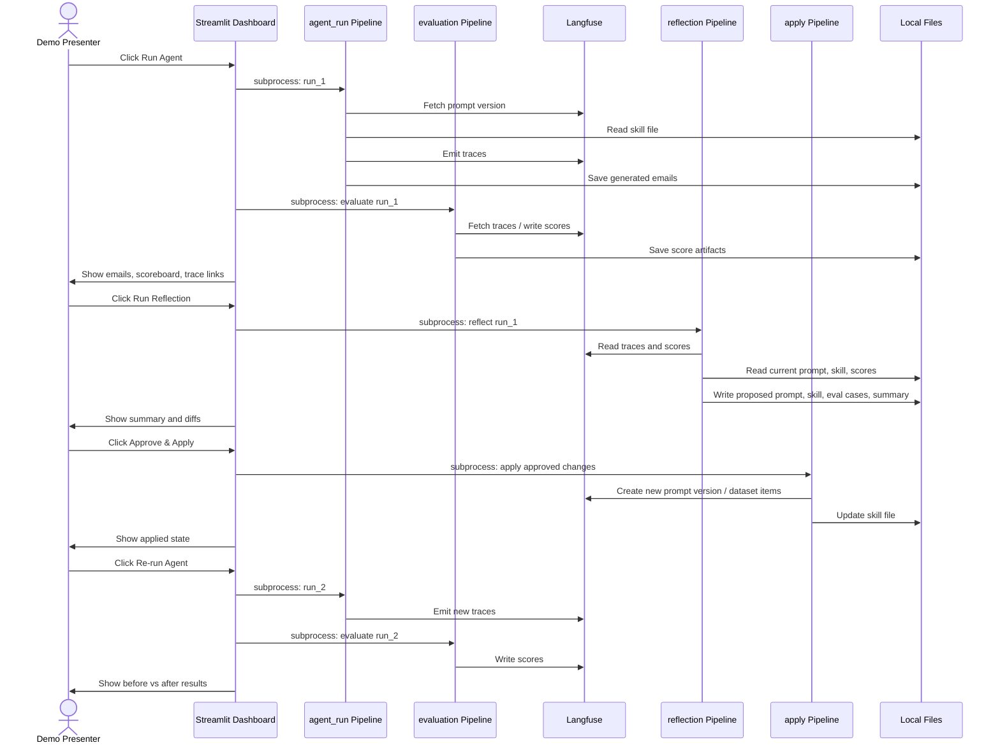

# Agentic Reflection / Continuous Learning POC Specification

## 0. Purpose of this document

This specification is intended to be pasted into Claude, ChatGPT, Cursor, Windsurf, or any code-generation LLM to build a working proof of concept end to end.

The goal is not just to build backend scripts. The goal is to produce a demo-ready application that shows a non-technical audience how a B2B campaign agent improves itself through an agentic reflection loop.

The POC must include:

1. Synthetic telco B2B data.
2. A deliberately mediocre campaign email agent.
3. Trace capture in Langfuse.
4. Evaluation using LLM-as-judge plus deterministic heuristics.
5. A reflection meta-agent that proposes improvements.
6. A human approval gate.
7. Application of approved changes to prompt, skill file, and eval dataset.
8. A second run that shows measurable improvement.
9. A Streamlit dashboard that makes the whole loop visually clear.

---

## 1. Executive summary

Build a single-page Streamlit demo called **B2B Campaign Agent — Reflection Demo**.

The demo shows a telco B2B sales outreach agent generating personalised campaign emails for synthetic customers. The first version of the agent is intentionally under-specified, so its initial outputs are mediocre. The system evaluates those outputs, reflects on the failures, proposes improvements to the agent's prompt and skill file, adds failure-derived regression cases, and then re-runs the same evaluation to show improvement.

The main story for the audience:

> An agent should not just run. It should learn from traces, failures, and evaluations. This demo shows a practical continuous-learning loop where agent traces become improvement signals, and those signals update the agent's inputs under human control.

Closing line for the demo:

> The same loop trivially extends to cross-sell, pricing, service assurance, or any other agent — different agent, same reflection pipelines.

---

## 2. Demo narrative

The demo must be understandable to a non-technical audience.

The dashboard should make the following narrative obvious:

1. **The agent generated emails.**
   - We can inspect the emails.
   - We can inspect the traces in Langfuse.
   - We can see a score.

2. **The system reflected on failures.**
   - It identified what went wrong.
   - It explained what it changed.
   - It showed the exact diffs.
   - A human approved the changes.

3. **The agent improved.**
   - The same cases were re-run.
   - Scores improved.
   - Side-by-side emails look visibly better.
   - Failures became regression cases for the next cycle.

---

## 3. Scope

### 3.1 In scope

- Synthetic telco B2B customer data.
- Synthetic telco product catalogue.
- Synthetic evaluation cases with ground-truth expectations.
- A campaign email generation agent.
- A versioned system prompt stored in Langfuse where feasible.
- A local markdown skill file.
- Langfuse tracing for agent runs, evaluations, scores, prompt versions, and run metadata.
- LLM-as-judge scoring.
- Heuristic scoring.
- Reflection meta-agent.
- Prompt diff, skill diff, and new eval case diff.
- Human approval in UI.
- Streamlit dashboard.
- Kedro-style modular pipeline structure.
- Optional Kedro-Viz view embedded or linked from the Streamlit dashboard.
- Repeatable local setup using `.env`.
- Run scripts and make commands.

### 3.2 Out of scope

- Real telco data.
- Production-grade multi-tenancy.
- Production authentication.
- Production deployment hardening.
- Ontology or graph updates.
- Long-term reinforcement learning.
- Automated prompt deployment without human approval.
- Complex orchestration infrastructure.

---

## 4. Target architecture

### 4.1 Conceptual architecture



### 4.2 Runtime flow



### 4.3 Pipeline architecture

Use a lightweight Kedro-style structure even if full Kedro integration is simplified.

```mermaid
flowchart TB
    subgraph agent_run
        A1[load_eval_cases]
        A2[load_prompt]
        A3[load_skill_file]
        A4[generate_email]
        A5[emit_trace]
        A6[save_outputs]
        A1 --> A4
        A2 --> A4
        A3 --> A4
        A4 --> A5
        A4 --> A6
    end

    subgraph evaluation
        B1[load_outputs]
        B2[run_heuristic_scorers]
        B3[run_llm_judge]
        B4[aggregate_scores]
        B5[write_langfuse_scores]
        B1 --> B2
        B1 --> B3
        B2 --> B4
        B3 --> B4
        B4 --> B5
    end

    subgraph reflection
        C1[load_traces_scores]
        C2[load_current_prompt_skill]
        C3[summarize_failures]
        C4[propose_prompt]
        C5[propose_skill]
        C6[derive_eval_cases]
        C7[write_proposals]
        C1 --> C3
        C2 --> C3
        C3 --> C4
        C3 --> C5
        C3 --> C6
        C4 --> C7
        C5 --> C7
        C6 --> C7
    end

    subgraph apply
        D1[validate_proposals]
        D2[create_prompt_version]
        D3[write_skill_file]
        D4[append_dataset_cases]
        D5[mark_applied]
        D1 --> D2
        D1 --> D3
        D1 --> D4
        D2 --> D5
        D3 --> D5
        D4 --> D5
    end
```



---

## 5. Technology choices

### 5.1 Required

- Python 3.10+
- Streamlit
- Langfuse
- OpenAI-compatible LLM provider or any configurable chat model
- Pandas
- Pydantic
- Python dotenv
- Rich or standard logging
- Difflib for text diffs
- Pytest for tests

### 5.2 Recommended

- Kedro for pipeline and project structure (follow `kedro new` layout conventions).
- Kedro-Datasets for built-in dataset types (`json.JSONDataset`, `pandas.CSVDataset`, `MemoryDataset`).
- `kedro-datasets[langfuse]` (experimental) for Langfuse integration — no custom dataset code needed:
  - `kedro_datasets_experimental.langfuse.LangfusePromptDataset` — syncs YAML/JSON prompt files to/from Langfuse prompt versions.
  - `kedro_datasets_experimental.langfuse.LangfuseTraceDataset` — injects a Langfuse tracing client into nodes; read-only (save is not supported).
  - `kedro_datasets_experimental.langfuse.LangfuseEvaluationDataset` — syncs eval cases to/from a Langfuse dataset.
  - All three are registered in `catalog_langfuse.yml` and use `langfuse_credentials` from `conf/local/credentials.yml`.
- Kedro-Viz for pipeline visualization (`kedro viz run`).
- Plotly for simple dashboard charts.
- Ruff for linting.

### 5.3 Langfuse expectations

Use Langfuse for:

- Prompt management/versioning where feasible.
- Tracing agent runs.
- Adding scores to traces/generations.
- Storing or referencing evaluation datasets.
- Links from Streamlit to trace pages.

All Langfuse access goes through `kedro_datasets_experimental.langfuse.*` catalog entries — no custom integration module is needed. See §15 for details.

---

## 6. Repository structure

Generate the repository with this structure, following Kedro project conventions:

```text
agentic-reflection-poc/
  README.md
  .env.example              # Reference only — actual secrets go in conf/local/credentials.yml
  pyproject.toml            # Includes [tool.kedro] section
  requirements.txt
  Makefile
  app.py                    # Streamlit entry point

  conf/
    base/
      catalog.yml           # All dataset definitions (emails, scores, proposals, prompts)
      catalog_langfuse.yml  # Langfuse-specific dataset entries (prompt, traces, eval datasets)
      parameters.yml        # Shared parameters (model names, run config, demo flags)
      parameters_agent_run.yml
      parameters_evaluation.yml
      parameters_reflection.yml
      parameters_apply.yml
    local/
      credentials.yml       # API keys — gitignored; copy from .env.example comments
      .gitkeep

  data/
    synthetic/
      customers.json
      products.json
      eval_cases.json
    intermediate/
      .gitkeep
    outputs/
      .gitkeep              # Generated emails and per-case scores land here
    reporting/
      .gitkeep              # Aggregate scores, proposals, diffs land here
    demo_state.json         # Streamlit state machine (not a Kedro dataset)

  prompts/
    seed_system_prompt.yaml
    current_system_prompt.yaml

  skills/
    b2b-email-style.md

  src/
    reflection_demo/
      __init__.py
      __main__.py           # Kedro CLI entry point
      pipeline_registry.py  # Registers all pipelines by name
      settings.py           # Kedro hooks, plugin config
      models.py             # Pydantic models (CustomerProfile, EvalCase, etc.)
      llm.py                # LLM client abstraction
      state.py              # Demo state machine helpers
      diffing.py            # Prompt/skill diff utilities

      pipelines/
        __init__.py
        agent_run/
          __init__.py
          nodes.py          # load_eval_cases, load_prompt, load_skill_file,
                            # generate_email, emit_trace, save_outputs
          pipeline.py       # create_pipeline() wiring nodes via kedro.pipeline.node
        evaluation/
          __init__.py
          nodes.py          # load_outputs, run_heuristic_scorers, run_llm_judge,
                            # aggregate_scores, write_langfuse_scores
          pipeline.py
        reflection/
          __init__.py
          nodes.py          # load_traces_scores, load_current_prompt_skill,
                            # summarize_failures, propose_prompt, propose_skill,
                            # derive_eval_cases, write_proposals
          pipeline.py
        apply/
          __init__.py
          nodes.py          # validate_proposals, create_prompt_version,
                            # write_skill_file, append_dataset_cases, mark_applied
          pipeline.py
        data_seed/
          __init__.py
          nodes.py          # generate_customers, generate_products, generate_eval_cases
          pipeline.py

      ui/
        __init__.py
        components.py
        charts.py
        langfuse_panels.py
        runner.py           # Streamlit subprocess helper (kedro run wrapper)

  tests/
    test_scoring.py
    test_state_machine.py
    test_reflection_outputs.py
    test_nodes/
      test_agent_run_nodes.py
      test_evaluation_nodes.py
```

### 6.1 pyproject.toml [tool.kedro] section

```toml
[tool.kedro]
package_name = "reflection_demo"
project_name = "agentic-reflection-poc"
kedro_init_version = "1.0.0"
source_dir = "src"
```

### 6.2 pipeline_registry.py

Register all pipelines so `kedro run --pipeline <name>` works:

```python
"""Project pipelines."""

from kedro.framework.project import find_pipelines
from kedro.pipeline import Pipeline


def register_pipelines() -> dict[str, Pipeline]:
    """Register the project's pipelines.

    Returns:
        A mapping from pipeline names to ``Pipeline`` objects.
    """
    pipelines = find_pipelines(raise_errors=True)
    pipelines["__default__"] = sum(pipelines.values())
    return pipelines
```

### 6.3 conf/base/catalog.yml structure

All file-backed datasets use Kedro layer annotations:

```yaml
# layer: synthetic
customers:
  type: json.JSONDataset
  filepath: data/synthetic/customers.json
  metadata:
    kedro-viz:
      layer: synthetic

eval_cases:
  type: json.JSONDataset
  filepath: data/synthetic/eval_cases.json

# layer: outputs — parameterised by run_id at runtime
"{run_id}.emails":
  type: json.JSONDataset
  filepath: data/outputs/{run_id}/emails.json

"{run_id}.case_scores":
  type: json.JSONDataset
  filepath: data/outputs/{run_id}/case_scores.json

# layer: reporting
"{run_id}.aggregate_scores":
  type: json.JSONDataset
  filepath: data/reporting/{run_id}/aggregate_scores.json

"{proposal_id}.proposal":
  type: json.JSONDataset
  filepath: data/reporting/{proposal_id}/proposal.json
```

### 6.3a conf/base/catalog_langfuse.yml structure

```yaml
# Prompt — local YAML is source of truth; synced to Langfuse on save
campaign_prompt:
  type: kedro_datasets_experimental.langfuse.LangfusePromptDataset
  filepath: prompts/current_system_prompt.yaml
  prompt_name: ${globals:langfuse_prompt_name}
  prompt_type: text
  credentials: langfuse_credentials
  sync_policy: local
  save_args:
    labels: ["production"]

# Seed prompt — written once during data_seed pipeline
seed_campaign_prompt:
  type: kedro_datasets_experimental.langfuse.LangfusePromptDataset
  filepath: prompts/seed_system_prompt.yaml
  prompt_name: ${globals:langfuse_prompt_name}
  prompt_type: text
  credentials: langfuse_credentials
  sync_policy: local

# Trace client — injected into agent and evaluation nodes as a client object
# LangfuseTraceDataset is read-only: load() returns a Langfuse SDK client, save() raises NotImplementedError
langfuse_tracer:
  type: kedro_datasets_experimental.langfuse.LangfuseTraceDataset
  credentials: langfuse_credentials
  mode: sdk

# Evaluation dataset — local JSON is source of truth; synced to Langfuse on save
eval_dataset:
  type: kedro_datasets_experimental.langfuse.LangfuseEvaluationDataset
  dataset_name: ${globals:langfuse_dataset_name}
  filepath: data/synthetic/eval_cases.json
  sync_policy: local
  credentials: langfuse_credentials
  metadata:
    project: agentic-reflection-poc
```

**Important usage note for `langfuse_tracer`:** nodes that emit traces receive `langfuse_tracer` as an input (the Langfuse SDK client). They call `client.trace(...)` / `client.score(...)` directly. The dataset is never saved — do not list it as a node output.

### 6.4 conf/local/credentials.yml structure (gitignored)

```yaml
openai_credentials:
  api_key: ""

langfuse_credentials:
  public_key: ""
  secret_key: ""
  host: "https://cloud.langfuse.com"
```

Pass credentials to datasets and nodes via the catalog and Kedro's credentials injection, not via `os.getenv` scattered across node functions.

---

## 7. Configuration

Kedro separates secrets from parameters. Follow this split:

### 7.1 conf/local/credentials.yml (gitignored, never committed)

```yaml
openai_credentials:
  api_key: ""               # OPENAI_API_KEY

langfuse_credentials:
  public_key: ""            # LANGFUSE_PUBLIC_KEY
  secret_key: ""            # LANGFUSE_SECRET_KEY
  host: "https://cloud.langfuse.com"
  project_id: ""
```

### 7.2 conf/base/parameters.yml (committed, no secrets)

```yaml
# LLM model selection
openai_model: "gpt-4o-mini"
openai_judge_model: "gpt-4o-mini"
openai_reflection_model: "gpt-4o"

# Langfuse resource names
langfuse_prompt_name: "b2b-campaign-agent-system-prompt"
langfuse_dataset_name: "b2b-campaign-agent-eval"

# Demo controls
demo_force_improvement: true
demo_use_langfuse: true
demo_use_kedro_viz: false
```

### 7.3 .env.example

Keep `.env.example` as a reference card for developers setting up `conf/local/credentials.yml`. It is not loaded at runtime by Kedro. Streamlit's `app.py` may optionally load `.env` for non-Kedro environment needs (e.g., Streamlit Cloud deployment), but all pipeline code must read config through Kedro's parameter/credentials injection.

```bash
# Copy values into conf/local/credentials.yml — do not use this file directly in pipelines

# LLM provider
OPENAI_API_KEY=

# Langfuse
LANGFUSE_PUBLIC_KEY=
LANGFUSE_SECRET_KEY=
LANGFUSE_HOST=https://cloud.langfuse.com
LANGFUSE_PROJECT_ID=
```

`demo_force_improvement: true` is allowed for demo reliability. It must not fake individual results silently. Instead, it should make the reflection output more prescriptive and enforce stricter prompt/skill improvements so run 2 reliably improves.

---

## 8. Data specification

### 8.1 Customers

Create approximately 10 synthetic telco B2B customer profiles.

Schema:

```json
{
  "customer_id": "cust_001",
  "company_name": "Northstar Logistics",
  "industry": "Logistics",
  "size": "Mid-market",
  "employee_count": 850,
  "locations": 18,
  "region": "UK & Ireland",
  "current_products": ["MPLS", "Business Broadband"],
  "account_tenure_years": 6,
  "known_pain_points": ["rising network costs", "warehouse connectivity gaps"],
  "strategic_initiatives": ["fleet digitisation", "IoT tracking"],
  "tone_preference": "practical and ROI-oriented",
  "relationship_context": "long-standing account with annual renewal in Q3"
}
```

Include varied industries:

- Logistics
- Healthcare
- Manufacturing
- Retail
- Financial services
- Education
- Public sector
- Energy
- Professional services
- Construction

### 8.2 Products

Create approximately 5 telco B2B products.

Schema:

```json
{
  "product_id": "prod_001",
  "name": "Managed SD-WAN",
  "category": "Connectivity",
  "ideal_for": ["multi-site businesses", "cost optimization", "cloud migration"],
  "value_props": [
    "improves application performance across sites",
    "reduces dependency on legacy MPLS",
    "centralized policy and traffic management"
  ],
  "avoid_claims": [
    "guaranteed 50% cost reduction", "instant deployment"],
  "cta": "book a 30-minute network optimisation review"
}
```

Recommended product catalogue:

1. Managed SD-WAN
2. Private 5G
3. IoT Connectivity Management
4. Cloud Contact Centre
5. Cyber Threat Monitoring

### 8.3 Evaluation cases

Create approximately 20 eval cases as customer/product pairs.

Schema:

```json
{
  "case_id": "case_001",
  "customer_id": "cust_001",
  "product_id": "prod_001",
  "ground_truth": {
    "must_mention": ["multi-site", "network costs", "fleet digitisation"],
    "must_not_mention": ["guaranteed 50% cost reduction", "instant deployment"],
    "desired_cta_type": "network optimisation review",
    "personalization_angle": "connect SD-WAN to warehouse and fleet connectivity needs",
    "target_persona": "IT Director"
  }
}
```

The 20 cases must include:

- Obvious good-fit cases.
- Harder cases where product fit is weaker.
- Cases that test grounding.
- Cases that test personalization.
- Cases that test CTA specificity.

---

## 9. Agent specification

### 9.1 Agent input

```json
{
  "customer": { "...": "customer profile" },
  "product": { "...": "product profile" },
  "skill_markdown": "...",
  "system_prompt": "..."
}
```

### 9.2 Agent output

```json
{
  "case_id": "case_001",
  "subject": "Modernise connectivity across your logistics network",
  "body": "Hi ...",
  "metadata": {
    "prompt_version": "v1",
    "skill_version": "local_hash",
    "model": "gpt-4o-mini",
    "run_id": "run_001"
  }
}
```

### 9.3 Seed mediocre prompt

`prompts/seed_system_prompt.yaml` (text prompt, loaded by `LangfusePromptDataset`):

```yaml
prompt: |
  You are a B2B sales email assistant for a telecom company.
  Write a short outreach email promoting the given product to the given customer.
  Include a subject and body.
  Be professional.
```

`prompts/current_system_prompt.yaml` is a copy of the seed at project initialisation and is overwritten by the apply pipeline after reflection.

### 9.4 Seed mediocre skill file

`skills/b2b-email-style.md`:

```markdown
# B2B Email Style Guide

- Be clear and professional.
- Mention the product.
- Keep it concise.
- Include a call to action.
```

### 9.5 Expected improved behavior after reflection

After reflection, the prompt and skill file should push the agent to:

- Use customer-specific industry, size, current products, tenure, and pain points.
- Tie product value props to the customer's actual situation.
- Avoid unsupported claims and banned product claims.
- Include one clear CTA that matches the product.
- Write a crisp subject line.
- Keep email body between 90 and 170 words.
- Avoid hallucinated SKUs, prices, discounts, guarantees, or technical capabilities.
- Use a business-friendly tone.

---

## 10. Scoring specification

### 10.1 Score dimensions

Each case receives a score out of 10.

Recommended weighting:

| Dimension | Type | Weight |
|---|---:|---:|
| Subject present and relevant | heuristic + LLM | 10% |
| Length in target range | heuristic | 10% |
| CTA present and specific | heuristic + LLM | 15% |
| Groundedness / no hallucination | heuristic + LLM | 20% |
| Personalization | LLM | 25% |
| Writing quality | LLM | 20% |

### 10.2 Heuristic scorers

Implement deterministic scorers:

1. `subject_present`: subject is non-empty.
2. `subject_length_ok`: subject between 35 and 90 characters.
3. `body_length_ok`: body between 90 and 170 words.
4. `cta_present`: body contains CTA intent such as `book`, `schedule`, `review`, `workshop`, `call`, `meeting`, `discuss`.
5. `no_banned_claims`: body does not include product `avoid_claims`.
6. `no_fake_skus`: body does not contain patterns like `SKU-`, `PROD-`, `50%`, `guaranteed`, unless present in source product data.
7. `must_mention_coverage`: fraction of `ground_truth.must_mention` concepts represented.
8. `must_not_mention_clean`: none of `ground_truth.must_not_mention` present.

### 10.3 LLM-as-judge scorer

The judge must return structured JSON:

```json
{
  "writing_quality": 0-10,
  "personalization": 0-10,
  "groundedness": 0-10,
  "cta_quality": 0-10,
  "rationale": "plain-language explanation",
  "failure_tags": ["generic", "weak_cta", "not_grounded"]
}
```

Judge prompt requirements:

- Provide the customer profile, product profile, ground-truth annotations, generated subject, and generated body.
- Tell the judge to penalize generic copy.
- Tell the judge to penalize unsupported claims.
- Tell the judge to reward specific connection to customer pain points and initiatives.
- Tell the judge to output JSON only.

### 10.4 Aggregate scoring

For each run, write:

```json
{
  "run_id": "run_1",
  "aggregate_score": 5.2,
  "dimension_scores": {
    "writing_quality": 6.1,
    "personalization": 3.8,
    "groundedness": 6.5,
    "cta_quality": 4.2,
    "heuristics": 5.5
  },
  "failure_tag_counts": {
    "generic": 12,
    "weak_cta": 9,
    "missing_personalization": 8
  }
}
```

Persist (via catalog entries — not hardcoded paths in node code):

```text
data/outputs/{run_id}/emails.json
data/outputs/{run_id}/case_scores.json
data/reporting/{run_id}/aggregate_scores.json
```

---

## 11. Reflection specification

### 11.1 Reflection inputs

The reflection meta-agent receives:

- Current system prompt.
- Current skill file.
- All generated emails from run 1.
- Per-case scores.
- Aggregate scores.
- Failure tags.
- Worst 5 cases.
- Best 3 cases for contrast.
- Product catalogue constraints.
- Current eval cases.

### 11.2 Reflection output

The reflection output must be machine-readable JSON plus markdown files.

Primary JSON:

```json
{
  "summary": {
    "identified": [
      {
        "issue": "Emails were too generic",
        "evidence": "12/20 cases had low personalization scores; 8 ignored industry or company size.",
        "example_case_ids": ["case_003", "case_007"]
      }
    ],
    "fixed": [
      {
        "change": "Added explicit instruction to use industry, current products, pain points, and initiatives.",
        "target": "system_prompt"
      }
    ],
    "reasons": [
      {
        "reason": "The lowest scores were driven by missing personalization, so the new prompt forces evidence-backed personalization before drafting."
      }
    ]
  },
  "new_system_prompt": "...",
  "new_skill_file": "...",
  "new_eval_cases": [
    {
      "case_id": "regression_001",
      "source_failure_case_id": "case_003",
      "customer_id": "cust_004",
      "product_id": "prod_002",
      "ground_truth": {
        "must_mention": ["..."],
        "must_not_mention": ["..."],
        "desired_cta_type": "...",
        "personalization_angle": "...",
        "target_persona": "..."
      },
      "reason_added": "Catches generic copy for healthcare + Private 5G cases."
    }
  ]
}
```

Also write (via catalog entries):

```text
data/reporting/{proposal_id}/reflection_summary.md
data/reporting/{proposal_id}/new_system_prompt.yaml
data/reporting/{proposal_id}/new_b2b_email_style.md
data/reporting/{proposal_id}/new_eval_cases.json
data/reporting/{proposal_id}/prompt_diff.html
data/reporting/{proposal_id}/skill_diff.html
data/reporting/{proposal_id}/proposal.json
```

### 11.3 Reflection constraints

The meta-agent must not:

- Remove grounding constraints.
- Add unsupported product claims.
- Add fake SKUs, pricing, discounts, or guarantees.
- Make the agent overfit to only the 20 eval cases.
- Automatically apply its own changes.

The meta-agent must:

- Explain changes in plain language.
- Show evidence from scores and traces.
- Generate regression cases based on failure modes.
- Keep changes small enough to be understandable in a demo.

---

## 12. Apply specification

The apply step runs only after UI approval.

Inputs:

- `proposal_id`
- Proposed system prompt
- Proposed skill file
- Proposed eval cases

Actions:

1. Validate proposal files exist.
2. Validate proposed prompt contains required sections.
3. Validate skill file contains style, personalization, CTA, and guardrail sections.
4. Validate eval cases conform to schema.
5. Back up current prompt and skill file.
6. Apply prompt:
   - Write the improved prompt to `prompts/current_system_prompt.yaml`.
   - Save via `campaign_prompt` catalog entry — `LangfusePromptDataset` with `sync_policy: local` will push it as a new Langfuse prompt version automatically.
   - Fallback (no Langfuse credentials): write to `prompts/current_system_prompt.yaml` only and log the version locally.
7. Apply skill:
   - Write to `skills/b2b-email-style.md`.
8. Apply eval cases:
   - Append to local `data/synthetic/eval_cases.json` with `is_regression=true`.
   - Prefer: create dataset items in Langfuse.
9. Write applied marker:

```json
{
  "proposal_id": "proposal_001",
  "applied_at": "2026-05-19T00:00:00Z",
  "prompt_version": "v2",
  "skill_hash": "...",
  "new_eval_case_ids": ["regression_001"]
}
```

---

## 13. Streamlit UI specification

### 13.0 Visual design system

Apply a consistent design language across the entire dashboard using Streamlit's `st.markdown` with `unsafe_allow_html=True` and a global CSS block injected at app startup.

#### Color palette

| Role | Color | Hex |
|---|---|---|
| Page background | White | `#FFFFFF` |
| Card / panel background | Off-white | `#F7F7F7` |
| Card border | Light grey | `#E2E2E2` |
| Primary text | Near-black | `#1A1A1A` |
| Secondary text / labels | Mid-grey | `#6B6B6B` |
| Primary action button | Black | `#000000` |
| Primary button text | White | `#FFFFFF` |
| Disabled button | Light grey | `#D0D0D0` |
| Success / improvement indicator | Dark green | `#1A7A4A` |
| Score badge background | Off-white | `#F0F0F0` |
| Score badge border | Grey | `#CCCCCC` |
| Diff added line background | Very light green | `#F0FFF4` |
| Diff removed line background | Very light red | `#FFF5F5` |
| Tab active underline | Black | `#000000` |
| Divider | Light grey | `#EBEBEB` |

Do not use saturated colours for decorative purposes. The only accent colour is the improvement green (`#1A7A4A`) used exclusively for positive score deltas and success indicators.

#### Typography

- Page title: `font-size: 28px; font-weight: 700; color: #1A1A1A`
- Section heading (step label): `font-size: 18px; font-weight: 600; color: #1A1A1A`
- Card heading: `font-size: 15px; font-weight: 600; color: #1A1A1A`
- Body / labels: `font-size: 14px; font-weight: 400; color: #1A1A1A`
- Secondary label: `font-size: 12px; font-weight: 400; color: #6B6B6B`
- Score number (large): `font-size: 36px; font-weight: 700`

#### Cards

Use a reusable `card()` component in `ui/components.py`:

```python
def card(title: str, body: str, border_left_color: str = "#E2E2E2") -> None:
    st.markdown(f"""
    <div style="background:#F7F7F7; border:1px solid #E2E2E2;
                border-left: 4px solid {border_left_color};
                border-radius:6px; padding:16px 20px; margin-bottom:12px;">
      <div style="font-size:15px;font-weight:600;color:#1A1A1A;margin-bottom:6px;">{title}</div>
      <div style="font-size:14px;color:#1A1A1A;">{body}</div>
    </div>""", unsafe_allow_html=True)
```

Use `border_left_color="#1A7A4A"` for positive/success cards, `#1A1A1A` for neutral, `#C0392B` for failure/warning.

#### Tabs

Use Streamlit's `st.tabs()`. Override default tab styling via injected CSS so tabs look like clean embedded navigation — flat, no rounded corners, active tab underlined in black:

```css
div[data-baseweb="tab-list"] {
    border-bottom: 2px solid #E2E2E2;
    gap: 0px;
}
div[data-baseweb="tab"] {
    background: transparent;
    border: none;
    padding: 10px 20px;
    font-size: 14px;
    font-weight: 500;
    color: #6B6B6B;
}
div[aria-selected="true"][data-baseweb="tab"] {
    color: #1A1A1A;
    border-bottom: 2px solid #1A1A1A;
    font-weight: 600;
}
div[data-baseweb="tab-panel"] {
    padding: 20px 0px;
    background: #FFFFFF;
}
```

#### Step blocks

Each step (1, 2, 3) is visually separated by a full-width white card with a thin top border. Completed steps show a small `✓ Done` badge. Active step is unlocked; future steps are visually muted (labels greyed out, buttons disabled).

### 13.1 Required layout

Single-page Streamlit dashboard.

Title:

```text
B2B Campaign Agent — Reflection Demo
```

Subtitle:

```text
A telco B2B outreach agent improves itself by reflecting on traces, scores, prompts, and skills.
```

### 13.2 State machine

Use strict state gating:

```text
idle -> run_1_done -> reflected -> applied -> run_2_done
```

Persist state in:

```text
data/demo_state.json
```

This file sits at the data root (not inside a Kedro layer) because it is Streamlit UI state, not a pipeline artifact.

Schema:

```json
{
  "state": "idle",
  "run_1_id": null,
  "proposal_id": null,
  "applied_id": null,
  "run_2_id": null
}
```

Rules:

- In `idle`, only Step 1 button is enabled.
- In `run_1_done`, Step 2 button is enabled.
- In `reflected`, Approve & Apply is enabled.
- In `applied`, Step 3 button is enabled.
- In `run_2_done`, all result tabs are visible.
- Provide a sidebar `Reset Demo` button for development only.

### 13.3 Page wireframe

```text
╔══════════════════════════════════════════════════════════════╗
║  B2B Campaign Agent — Reflection Demo                        ║
║  A telco B2B outreach agent that learns from its own traces  ║
╠══════════════════════════════════════════════════════════════╣
║  ● Step 1  ──────  ○ Step 2  ──────  ○ Step 3               ║
╠══════════════════════════════════════════════════════════════╣
║  STEP 1 — Generate & Evaluate                      [✓ Done] ║
║  ┌────────────────────────────────────────────────────────┐  ║
║  │  [ ▶ Run Agent ]   Run 1 Score: 5.1 / 10              │  ║
║  └────────────────────────────────────────────────────────┘  ║
║  ─── Pipeline │ Emails │ Scoreboard │ Langfuse ────────────  ║
║  [tab content]                                               ║
╠══════════════════════════════════════════════════════════════╣
║  STEP 2 — Reflect & Approve                                  ║
║  ┌────────────────────────────────────────────────────────┐  ║
║  │  [ ▶ Run Reflection ]                                  │  ║
║  └────────────────────────────────────────────────────────┘  ║
║  ┌─── What failed ───┐ ┌─── What changed ──┐ ┌─── Why ───┐  ║
║  │  12/20 generic    │ │  Prompt: +5 rules │ │ Evidence  │  ║
║  │  9/20 weak CTA    │ │  Skill: +3 rules  │ │ from data │  ║
║  │  8/20 no pain pts │ │  +4 eval cases    │ │           │  ║
║  └───────────────────┘ └───────────────────┘ └───────────┘  ║
║  ─── Prompt diff │ Skill diff │ New eval cases ────────────  ║
║  [ ✓ Approve & Apply Changes ]                               ║
╠══════════════════════════════════════════════════════════════╣
║  STEP 3 — Re-run & Compare                                   ║
║  ┌────────────────────────────────────────────────────────┐  ║
║  │  [ ▶ Re-run Agent ]                                    │  ║
║  │  Before: 5.1/10  ──────────────────►  After: 8.4/10   │  ║
║  └────────────────────────────────────────────────────────┘  ║
║  ─── Before/After Scores │ Email comparison │ Summary ─────  ║
║  ┌────────────────────────────────────────────────────────┐  ║
║  │  ★ Reflection loop complete                            │  ║
║  │  Agent improved +3.3 points across 20 cases.           │  ║
║  │  Powered by Kedro pipelines — ready to scale.          │  ║
║  └────────────────────────────────────────────────────────┘  ║
╚══════════════════════════════════════════════════════════════╝
```

### 13.4 Step 1 UI behavior

Button: `▶ Run Agent`

On click:

1. Run `kedro run --pipeline agent_run --params "run_id=run_1"` via the subprocess helper.
2. Run `kedro run --pipeline evaluation --params "run_id=run_1"` via the subprocess helper.
3. Show progress logs in a collapsible panel.
4. Update state to `run_1_done`.

Tabs:

#### Pipeline tab

- Show an iframe or link to local Kedro-Viz.
- Optional: show run status chips for nodes.

#### Emails tab

Show 3 to 5 sample emails.

Each card should contain:

- Company name.
- Product.
- Subject.
- Body.
- Score.
- Failure tags.

#### Scoreboard tab

Show:

- Aggregate score card.
- Dimension score bar chart.
- Per-case score table.
- Failure tag counts.

#### Langfuse tab

Show:

- Recent trace IDs and names.
- Score summaries.
- Links labeled `Open in Langfuse ->`.

If SDK embedding is too difficult, show a clean fallback:

```text
Langfuse traces were written successfully.
Open the Langfuse project to inspect trace details, prompt versions, and scores.
```

Then render trace links from stored metadata.

### 13.5 Step 2 UI behavior

Button: `▶ Run Reflection`

On click:

1. Run `kedro run --pipeline reflection --params "run_id=run_1"` via the subprocess helper.
2. Load proposal artifacts from `data/reporting/`.
3. Update state to `reflected`.

#### Reflection summary panel

After reflection completes, show a prominent **Reflection Intelligence Summary** panel before the diffs. This panel must be the visual centrepiece of Step 2 — it is the key moment of the demo.

**Layout: three equal columns, each a card with a left border accent.**

Column 1 — `#C0392B` left border — "What the agent got wrong":

```text
  What went wrong
  ───────────────
  ● 12 of 20 emails were too generic
    No mention of industry or company size
    → cases: case_003, case_007, case_012

  ● 9 of 20 emails had a weak call to action
    "Contact us" instead of a specific review
    → cases: case_001, case_005

  ● 8 of 20 emails missed customer pain points
    Ignored known pain points from profile
    → cases: case_004, case_009
```

Column 2 — `#1A1A1A` left border — "What the reflection changed":

```text
  What changed
  ────────────
  Prompt  +5 new instructions
  → Use industry, size, current products,
    pain points, and initiatives explicitly

  Skill file  +3 new rules
  → Enforce pain-point-led opening
  → Mandate one named CTA per product
  → Ban generic openers

  Eval cases  +4 regression cases
  → Derived from the 4 worst failures
```

Column 3 — `#1A7A4A` left border — "Why this will improve results":

```text
  Why this works
  ──────────────
  The lowest scores were driven by:
  personalization 3.8 / 10
  CTA quality 4.2 / 10

  The new prompt forces evidence-backed
  personalisation before drafting.
  The skill file now bans weak CTAs.

  Expected improvement:
  Personalization  +2.5 pts
  CTA quality      +2.0 pts
  Groundedness     +1.2 pts
```

Below the three-column summary, show tabs:

#### Prompt diff tab

Side-by-side or unified diff of `seed_system_prompt.yaml` vs proposed prompt. Use green background for added lines, light red for removed lines. Show character-level diff if line count is small.

#### Skill diff tab

Same diff treatment for `skills/b2b-email-style.md`.

#### New eval cases tab

Table of new regression cases with columns: `case_id`, `customer`, `product`, `failure_it_catches`. Each row links the source failure case.

Button: `✓ Approve & Apply Changes`

Style: full-width, black background, white text, `font-size: 16px`, `padding: 14px`. Label must read "Approve & Apply Changes" — not just "Apply".

On click:

1. Run `kedro run --pipeline apply --params "proposal_id={proposal_id}"` via the subprocess helper.
2. Update state to `applied`.
3. Show a brief confirmation banner: `Changes applied. Prompt v2 active. 4 regression cases added.`

### 13.6 Step 3 UI behavior

Button: `▶ Re-run Agent`

On click:

1. Run `kedro run --pipeline agent_run --params "run_id=run_2"` via the subprocess helper.
2. Run `kedro run --pipeline evaluation --params "run_id=run_2"` via the subprocess helper.
3. Update state to `run_2_done`.

#### Score headline

Show two large score badges side by side, centred, with a bold arrow between them:

```text
  ┌─────────────────┐        ┌─────────────────┐
  │  Before         │        │  After           │
  │   5.1 / 10      │  ────► │   8.4 / 10       │
  │  Run 1          │        │  Run 2  +3.3 ↑   │
  └─────────────────┘        └─────────────────┘
```

"Before" badge: off-white background, grey border.
"After" badge: white background, `#1A7A4A` border, delta in `#1A7A4A`.

#### Result tabs

Three tabs below the score headline: **Score comparison**, **Email comparison**, **What improved**.

**Score comparison tab:**
- Grouped bar chart (Plotly): dimension scores for Run 1 vs Run 2, side by side.
- Per-case score table with columns: `case_id`, `company`, `product`, `run_1_score`, `run_2_score`, `delta`. Sort by delta descending.

**Email comparison tab:**
- Show 3 side-by-side pairs for the worst-scoring cases in Run 1.
- Left column header: "Before reflection" (grey label).
- Right column header: "After reflection" (black label).
- Each email card: company, product, subject, body, score badge, failure tags (before) or empty tags (after).

**What improved tab:**
- Repeat the three-column summary from Step 2 (identified / changed / why) as a compact read-only recap.
- Below it, list the regression cases that were added and note that they will catch these failures in the next cycle.

#### Enterprise closing card

After all three tabs, render a full-width closing card with a `#1A7A4A` left border (6px). This card is the final impression for stakeholders. It must be visible without scrolling when Step 3 is complete.

```text
╔══════════════════════════════════════════════════════════════╗
║  Reflection loop complete                                    ║
║                                                              ║
║  The agent improved from 5.1/10 to 8.4/10 across 20 cases.  ║
║  Top gains: Personalisation +2.8 · CTA quality +2.1          ║
║             Groundedness +1.4                                ║
║  4 regression cases added to prevent these failures again.   ║
║                                                              ║
║  ─────────────────────────────────────────────────────────   ║
║                                                              ║
║  How this scales at enterprise level                         ║
║                                                              ║
║  Every step in this demo — agent run, evaluation,            ║
║  reflection, and apply — is a Kedro pipeline.               ║
║                                                              ║
║  Kedro pipelines are:                                        ║
║    · Modular  — swap the campaign agent for a pricing        ║
║      agent, a service-assurance agent, or a churn agent.     ║
║      The reflection pipelines stay the same.                 ║
║    · Observable  — every run is catalogued, versioned,       ║
║      and visible in Kedro-Viz. Nothing is a black box.       ║
║    · Reproducible  — any run can be re-executed from         ║
║      its exact inputs. Auditors and engineers both win.      ║
║    · Enterprise-ready  — runs on your own infra, connects    ║
║      to your data platform, and integrates with your         ║
║      existing MLOps stack.                                   ║
║                                                              ║
║  Different agent. Same reflection loop. Same Kedro backbone. ║
╚══════════════════════════════════════════════════════════════╝
```

Render the "How this scales" section as four short `card()` components in a 2×2 grid below the score summary paragraph, each with a one-line heading and two-line body.

Visual language:

- Use simple labels: `Before reflection`, `After reflection`.
- Avoid technical terms like embeddings, orchestration, or chain-of-thought.
- Explain Langfuse as `trace and evaluation system`.
- Explain Kedro as `pipeline framework that makes every step modular, observable, and reproducible`.

---

## 14. Subprocess runner requirements

Create a shared UI helper in `src/reflection_demo/ui/runner.py`:

```python
def run_pipeline(pipeline_name: str, params: dict[str, str] | None = None) -> subprocess.CompletedProcess:
    ...
```

Requirements:

- Invoke pipelines via `kedro run --pipeline <name>` using `subprocess`.
- Pass runtime parameters using `--params "key=value,key2=value2"`.
- Use `shutil.which("kedro")` to locate the kedro binary; fall back to `sys.executable -m kedro`.
- Capture stdout and stderr.
- Stream logs to a Streamlit placeholder if possible.
- Return non-zero exit codes as visible UI errors.
- Do not advance state if a pipeline run fails.

Example invocations:

```bash
kedro run --pipeline agent_run --params "run_id=run_1"
kedro run --pipeline evaluation --params "run_id=run_1"
kedro run --pipeline reflection --params "run_id=run_1"
kedro run --pipeline apply --params "proposal_id=proposal_001"
kedro run --pipeline agent_run --params "run_id=run_2"
kedro run --pipeline evaluation --params "run_id=run_2"
```

The `scripts/` directory may still exist as thin one-liner wrappers for CLI convenience (e.g., `run_cycle.py` that calls several pipelines in sequence), but all logic must live in pipeline nodes — scripts must not duplicate node logic.

---

## 15. Langfuse integration details

All Langfuse interaction goes through the three `kedro_datasets_experimental.langfuse.*` datasets — no custom adapter class is needed. The catalog entries in `catalog_langfuse.yml` are the integration boundary.

How each dataset is used in pipelines:

| Dataset | Catalog key | Used in pipeline | How |
|---|---|---|---|
| `LangfusePromptDataset` | `campaign_prompt` | `agent_run`, `apply` | Load: read current prompt text. Save: push new prompt version. |
| `LangfuseTraceDataset` | `langfuse_tracer` | `agent_run`, `evaluation` | Load: receive Langfuse SDK client. Call `client.trace()` / `client.score()` in node body. Never saved. |
| `LangfuseEvaluationDataset` | `eval_dataset` | `data_seed`, `apply` | Load: pull eval items. Save: push new/updated items. |

Fallback behavior:

- If `conf/local/credentials.yml` is absent or Langfuse keys are empty, pipelines detect this via a missing credentials key and run in local-only mode.
- Local-only mode: `campaign_prompt` reads/writes `prompts/current_system_prompt.yaml` only; tracing is skipped; eval cases use the local JSON file only.
- UI should clearly say `Local mode: Langfuse credentials not configured`.

Trace metadata should include:

```json
{
  "demo": "agentic-reflection-poc",
  "run_id": "run_1",
  "case_id": "case_001",
  "customer_id": "cust_001",
  "product_id": "prod_001",
  "prompt_version": "v1",
  "skill_hash": "..."
}
```

---

## 16. LLM integration details

Create `src/reflection_demo/llm.py` with provider abstraction:

```python
class LLMClient:
    def generate_json(self, system: str, user: str, schema: type[BaseModel]) -> BaseModel: ...
    def generate_text(self, system: str, user: str) -> str: ...
```

Requirements:

- Configurable model names.
- JSON parsing with retries.
- Temperature:
  - Agent generation: `0.7`
  - Judge: `0.0`
  - Reflection: `0.2`
- If LLM call fails, show an explicit error.
- For demo development, optionally support deterministic mock mode.

---

## 17. Data models

Use Pydantic models:

```python
class CustomerProfile(BaseModel): ...
class ProductProfile(BaseModel): ...
class EvalCase(BaseModel): ...
class EmailOutput(BaseModel): ...
class JudgeScore(BaseModel): ...
class CaseScore(BaseModel): ...
class AggregateScore(BaseModel): ...
class ReflectionProposal(BaseModel): ...
class DemoState(BaseModel): ...
```

All pipeline scripts should validate inputs and outputs using these models.

---

## 18. Acceptance criteria

### 18.1 Functional acceptance

The POC is complete when:

1. `make setup` or documented setup works.
2. `make seed` creates synthetic data and initial prompt/skill files.
3. `streamlit run app.py` launches the dashboard.
4. Step 1 runs the first agent pass and evaluation.
5. Step 1 shows generated emails, scores, and trace links or local trace fallback.
6. Step 2 generates a reflection summary.
7. Step 2 shows prompt diff, skill diff, and new eval cases.
8. Approve & Apply updates prompt, skill file, and eval cases.
9. Step 3 re-runs agent and evaluation.
10. Step 3 shows before/after improvement.
11. Run 1 and run 2 artifacts are saved locally.
12. The demo can run without real customer data.

### 18.2 Demo acceptance

The demo is successful when a non-technical audience can answer:

1. What did the agent produce?
2. How good was it?
3. What did the system learn from failures?
4. What changed?
5. Did the agent improve?
6. How would this generalize to another agent?

### 18.3 Target metrics

Expected outcome:

```text
Run 1 aggregate score: approximately 4.5 to 6.0 / 10
Run 2 aggregate score: approximately 7.5 to 8.8 / 10
Minimum visible improvement: +2.0 points
```

If the live LLM does not produce this reliably, strengthen the seed prompt weakness and reflection prompt specificity. Do not simply hard-code scores.

---

## 19. Testing requirements

Create tests for:

1. Heuristic scorers.
2. Weighted aggregate score calculation.
3. State machine transitions.
4. Proposal schema validation.
5. Apply step backup behavior.
6. Eval case append behavior.
7. Diff generation.

Minimum command:

```bash
pytest -q
```

---

## 20. README requirements

The README must include:

1. What the demo does.
2. Architecture diagram.
3. Setup steps.
4. Environment variable instructions.
5. How to seed data.
6. How to launch Streamlit.
7. How to run pipelines from CLI.
8. How to configure Langfuse.
9. Demo script for presenter.
10. Troubleshooting.

### 20.1 Presenter demo script

Include this script in the README:

```markdown
## Presenter script

1. "This is a campaign agent that writes telco B2B outreach emails.
   Right now it has a weak prompt and a vague skill file — intentionally."
2. Click **Run Agent**.
3. "20 emails generated, every one traced, every one scored. Score: around 5 out of 10.
   Let's look at why." Open one weak email. Point to the failure tags.
4. Open the Langfuse tab. "Every run is fully observable — traces, scores, prompt version, all here."
5. Click **Run Reflection**.
6. "A reflection agent just read every trace, every score, and the current prompt.
   It identified three failure patterns." Point to the three-column summary:
   — "12 out of 20 too generic."
   — "9 out of 20 weak call to action."
   — "8 out of 20 ignored the customer's pain points."
7. "Here is exactly what it proposes to change." Show prompt diff. Show skill diff.
8. "Notice: nothing has changed yet. A human reviews and approves."
9. Click **Approve & Apply Changes**.
10. "Prompt v2 is now active. 4 regression cases added to the eval set.
    The agent cannot regress on these failures in the next cycle."
11. Click **Re-run Agent**.
12. "Same 20 cases. Same evaluation. Score: around 8.4 out of 10.
    Plus 3.3 points. Personalisation up. CTAs specific. Pain points addressed."
    Point to the side-by-side email comparison.
13. Scroll to the closing card. Read: "Different agent. Same reflection loop. Same Kedro backbone."
14. "Swap the campaign agent for a pricing agent, a churn agent, a service-assurance agent —
    the reflection pipelines don't change. The observability doesn't change.
    The human approval gate doesn't change. That is what enterprise-scale looks like."
```

---

## 21. Implementation instructions for the coding LLM

When generating the codebase:

1. Build the complete repo, not isolated snippets.
2. Prefer simple, reliable implementation over complex abstractions.
3. Make the dashboard polished enough for an executive demo.
4. Keep all generated data synthetic.
5. Make local-only mode work even without Langfuse credentials.
6. Use Langfuse when credentials are present.
7. Do not block the POC on perfect Kedro-Viz embedding; provide a static pipeline fallback.
8. Avoid over-engineering deployment.
9. Make every pipeline runnable from CLI and from Streamlit.
10. Include enough sample data to demo immediately.
11. Include clear error messages.
12. Include tests.
13. Include a `Reset Demo` function.
14. Preserve all run artifacts so before/after comparison works.

---

## 22. Suggested build order

1. Create data models.
2. Create synthetic data seeding.
3. Create agent generation script.
4. Create heuristic scorers.
5. Add LLM judge.
6. Add local artifact persistence.
7. Add Langfuse adapter.
8. Add reflection meta-agent.
9. Add apply step.
10. Add Streamlit state machine.
11. Add Streamlit tabs and charts.
12. Add diffs.
13. Add before/after comparison.
14. Add tests.
15. Polish README and presenter script.

---

## 23. Minimal command interface

The following commands should work:

```bash
make install
make seed
make test
make app
make viz
make reset
make run-cycle
```

Where:

```makefile
install:
	pip install -r requirements.txt

seed:
	kedro run --pipeline data_seed

test:
	pytest -q

app:
	streamlit run app.py

viz:
	kedro viz run

reset:
	rm -rf data/intermediate/* data/outputs/* data/reporting/*
	kedro run --pipeline data_seed

run-cycle:
	kedro run --pipeline agent_run --params "run_id=run_1"
	kedro run --pipeline evaluation --params "run_id=run_1"
	kedro run --pipeline reflection --params "run_id=run_1"
```

---

## 24. UI polish requirements

### 24.1 Global rules

- White or off-white (`#F7F7F7`) backgrounds only. No coloured panels except the green closing card.
- Every colour used for meaning must have a text label alongside it — never rely on colour alone.
- Buttons are black when active, grey when disabled. Never use coloured primary buttons.
- All score numbers larger than body text. Score deltas always show sign (`+3.3`) and use green for positive.
- No clutter: every element on screen must serve the demo narrative. Remove anything decorative that does not tell the story.

### 24.2 Step cards

- Each step is a clean white block separated by a `1px #EBEBEB` horizontal rule.
- Step number shown as `STEP 1`, `STEP 2`, `STEP 3` — bold uppercase, left-aligned.
- Completed step shows a small `✓ Done` pill badge (black background, white text, `border-radius: 12px`).
- Future step headings are rendered in `#6B6B6B` (muted) until unlocked.

### 24.3 Buttons

- Active primary button: full black background, white text, no border-radius (flat style), `padding: 12px 24px`.
- Disabled button: `#D0D0D0` background, `#999999` text, `cursor: not-allowed`.
- `✓ Approve & Apply Changes` button is full-width and larger than other buttons to signal importance.

### 24.4 Tabs

- Follow the embedded tab CSS from §13.0.
- No scrolling within tabs where avoidable. Content should be naturally sized.
- Active tab: black underline, bold label.
- Inactive tab: mid-grey label, no underline.

### 24.5 Email cards

- White card, `1px #E2E2E2` border, `border-radius: 6px`.
- Score shown as a small pill badge in the top-right of the card.
- Failure tags shown as small grey pills below the body text. On run 2 cards, replaced with a `✓ Passed` green pill.

### 24.6 Diff views

- Use `st.code()` or custom HTML for diffs.
- Added lines: `background: #F0FFF4` (very light green).
- Removed lines: `background: #FFF5F5` (very light red).
- Line numbers shown in `#999999` monospace.

### 24.7 Log expanders

- Pipeline run logs collapsed by default under `▶ View pipeline logs`.
- Error logs expanded automatically if a pipeline fails.

### 24.8 Reflection summary panel (Step 2)

- Three cards in a row — see §13.5 for layout.
- This panel is the single most important visual moment in the demo. It must be immediately legible without reading all the text.
- Each card uses bullet points, not prose. Maximum 4 bullets per card.
- Evidence (case counts, scores) must be visible in every card.

### 24.9 Enterprise closing card (Step 3)

- Full-width, `6px #1A7A4A` left border.
- Two sections separated by a thin `#E2E2E2` divider:
  1. Score result paragraph — one or two sentences, numbers prominent.
  2. "How this scales" — four mini-cards in a 2×2 grid: **Modular**, **Observable**, **Reproducible**, **Enterprise-ready**.
- The four mini-cards use `#F7F7F7` background, `1px #E2E2E2` border, bold heading, two-line body.
- Closing sentence of the card (full width, centred, `font-style: italic`):
  ```text
  Different agent. Same reflection loop. Same Kedro backbone.
  ```

---

## 25. Definition of done

The POC is done when the repo can be cloned, configured, seeded, launched, and demoed end to end in under 10 minutes by following the README.

The most important deliverable is the Streamlit presentation layer. The backend can be simple, but the UI must clearly show:

1. What happened.
2. What failed.
3. What changed.
4. Who approved it.
5. What improved.

