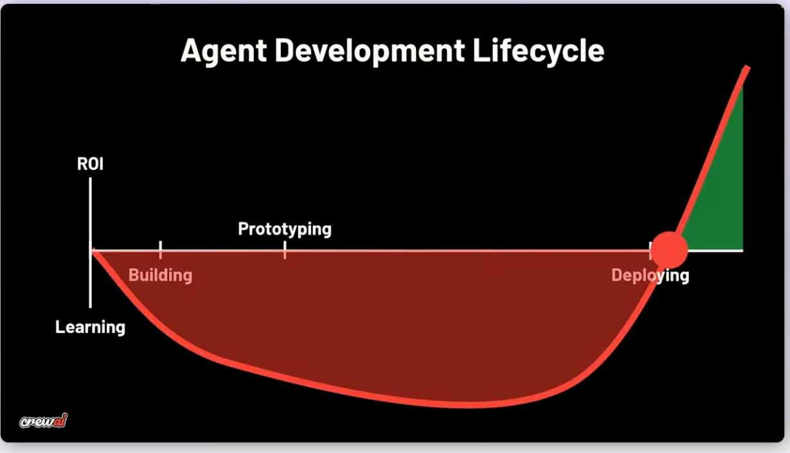
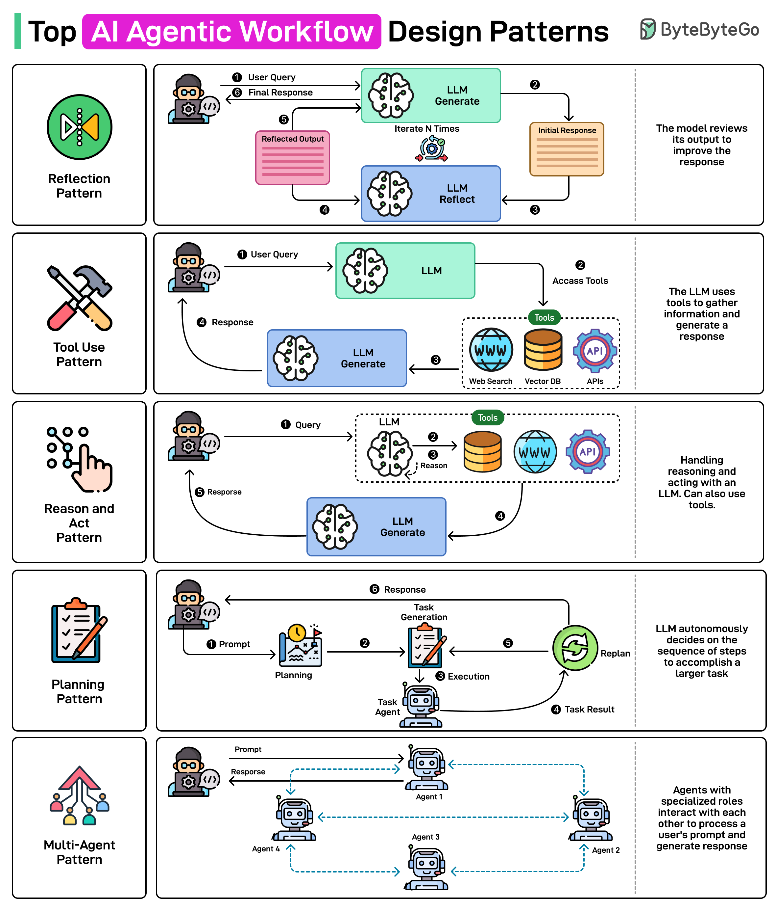

# Kedro + CrewAI: Production-Ready Agentic Workflows

**Overview:** This session is part of our Agentic Workflow series, explaining the feasibility and ease of integrating Kedro with CrewAI, an agentic framework. For prior demonstrations, see our earlier videos on integrations with LangGraph and Autogen.

## Production-Ready Agentic Workflows

### The Vision

Building robust, maintainable, production-ready data workflows that combine deterministic and agentic pipelines:

- **Kedro**: Kedro is a toolbox for production-ready data pipelines. Core components of Kedro are DataCatalog, Nodes and Pipelines
- **CrewAI**: CrewAI is a framework for building agentic workflows. Core components of CrewAI are Agents, Tasks, Tools, Crews and Processes



### Key Principles

1. **Agentic ≠ Unstructured** — Agents thrive within a pipeline framework for maintainability and testability
2. **Configuration and code separation** — Prompts & LLM settings live in YAML catalog; version in Git, A/B test freely
3. **Hybrid by Design** — Deterministic layers (parsing, reporting) + agentic layers (reasoning, evaluation)
4. **Observable & Traceable** — Visualization tools like Kedro-Viz or CrewAI's plot and optional tracing for full visibility

### Agentic Design Patterns



---

## Use Case — HR Candidate Screening

### The Problem
- **Scale**: Hundreds of resumes per role
- **Pain Point**: Manual screening is slow, inconsistent, and hard to audit
- **Requirement**: Structured evidence-based matching with clear recommendations

### The Solution

Extract and evaluate candidates using a **hybrid deterministic + agentic workflow**:

```
┌─────────────┐         ┌──────────────────────┐         ┌─────────────────┐
│ Job .docx   │ ────→   │ Parse & Structure    │ ────→   │ Job Metadata    │
│ Resume .docx│         │ (Deterministic)      │         │ Requirements    │
└─────────────┘         └──────────────────────┘         └─────────────────┘
       ↓                          ↓
       └──────────────────────────┴───────────────────────┐
                                  ↓
                    ┌──────────────────────────┐
                    │ Extract Evidence         │
                    │ Match & Evaluate         │
                    │ (Agentic Layer)          │
                    └──────────────────────────┘
                                  ↓
                    ┌──────────────────────────┐
                    │ Generate Report          │
                    │ Compose Email Draft      │
                    │ (Deterministic)          │
                    └──────────────────────────┘
                                  ↓
                    ┌──────────────────────────┐
                    │ HR Report + Email        │
                    └──────────────────────────┘
```

### Agents Involved
1. **Resume Parser Agent** — Used in our application pipeline to extract experience, skills, education
2. **Requirements Matcher** — Used in our screening pipeline to evaluate fit against job requirements
3. **Resume Evaluator** — Used in our screening pipeline to perform detailed assessment and provide a recommendation
4. **Reporting** — Generate audit trail and draft communications

### Architecture — Component Ownership

| **Component** | **Kedro** | **CrewAI** |
|---|---|---|
| **Data, Prompts & Config** | ✓ Catalog via `prompt datasets` | — |
| **Agent Context** | ✓ Built via `llm_context_node` | ✓ Consumes context |
| **Tools & Logic** | ✓ Catalog datasets | ✓ logic execution |
| **Agents & Tasks** | — | ✓ Role, goal, tasks, execution |
| **Pipeline Orchestration** | ✓ DAG execution and open to use any orchestrator | — |


### Project Structure

```
kedro-hr-crew-workflow/
│
├── conf/
│   ├── base/
│   │   ├── catalog.yml          # Data catalog (all I/O defined here)
│   │   ├── config_genai.yml     # LLM and prompt configurations
│   │   └── parameters.yml       # Project parameters
│   └── local/
│       └── credentials.yml      # API keys (gitignored)
│
├── data/
│   ├── prompts/                 # Agent prompts
│   │   ├── applications/        # Applications pipeline prompts
│   │   │   ├── resume_parser_agent_system_prompt.yml
│   │   │   └── resume_parsing_user_prompt.yml
│   │   └── screening/           # Screening pipeline prompts
│   │       ├── requirements_matcher_agent_system_prompt.yml
│   │       ├── requirements_matching_user_prompt.yml
│   │       ├── resume_evaluator_agent_system_prompt.yml
│   │       └── resume_evaluation_user_prompt.yml
│   │
│   ├── config/                  # Business rules & templates
│   │   ├── screening/           # Screening pipeline configuration
│   │   │   ├── matching_config.yml
│   │   │   └── scoring_config.yml
│   │   └── reporting/           # Reporting pipeline configuration
│   │       └── email_templates.yml
│   │
│   ├── sample/                  # Raw input documents
│   │   ├── jobs/raw_job_posting.docx
│   │   └── resumes/*.docx
│   │
│   ├── intermediate/            # Processing artifacts
│   │   ├── jobs/                # Job metadata + requirements
│   │   ├── applications/        # Evidence snippets + application
│   │   └── screening/           # Screening results
│   │
│   └── reports/                 # Final reports
│       └── *_hr_report.docx
│
├── docs/                        # Project related docs
├── scripts/                     # Project related scripts
└── src/hr_recruiting/
    ├── base/
    │   ├── agent.py             # Base agent class
    │   └── utils.py             # Shared utilities
    │
    ├── datasets/
    │   └── crew_model_client.py # CrewAI LLM dataset
    │
    └── pipelines/
        ├── jobs/                # Deterministic job processing
        ├── applications/        # Agentic application creation (1 agent)
        ├── screening/           # Agentic candidate screening (2 agents)
        └── reporting/           # Deterministic report generation
    └── pipeline_registry.py     # Registry of available pipelines
```

---

## Live Demonstration

### What We'll See
1. **Get to know our data**: We will briefly check on the data and conf files
2. **Pipeline registry**: We will see how our pipelines are discoverable during kedro run
3. **Trigger HR pipeline**: Trigger HR pipeline for one of our applicants and analyze the logs
4. **What is inside screening pipeline**: Check internals of screening pipeline
5. **Kedro-Viz**: Interactive pipeline visualisation (node coloring, preview_fn)
6. **Outputs**: Generated documents and structured data

---

## Roadmap — Production Readiness

### Immediate Improvements

- **Batch Processing**: Scale via PartitionedDataset and orchestrators
- **Evaluation Framework**: Dedicated evaluation nodes + metric tracking
- **Tracing & Monitoring**: Langfuse/Opik integration for observability
- **Scheduling**: Run via Airflow, Prefect, or event-driven architecture
- **Security**: Secrets management in `conf/local/`

*This project is developed with event-driven architecture in mind and can easily be extended to use batch processing*

### Kedro Evolution — What's Coming

| **Phase** | **Focus** |
|-----------|-----------|
| **Now** | Patterns and feedback from the community |
| **Next** | First-class evaluation support for agents/GenAI |
| **Future** | Streaming patterns for token/chunk streaming |

> You can adopt these patterns in your projects **right now**.

---

## Key Takeaways

✅ **Agentic + Structured = Best of Both Worlds**  
Combine agentic intelligence with Kedro's pipeline robustness

✅ **Configuration-Driven Development**  
Prompts, LLM settings, and workflows live in YAML — version, test, and audit in Git

✅ **Hybrid Workflows Pay Off**  
Deterministic stages handle parsing and reporting; agentic stages handle reasoning and evaluation

✅ **Production-Ready from Day One**  
Built-in support for observability, scaling, and orchestration

✅ **This Repository as Reference**  
Use the HR screening workflow as a blueprint for your own Kedro + CrewAI projects

---

## Questions?

**Thank you for your time.**

Questions, feedback, and contributions welcome!

---

## References

- [Kedro](https://docs.kedro.org/en/stable/)
- [CrewAI](https://docs.crewai.com/)
