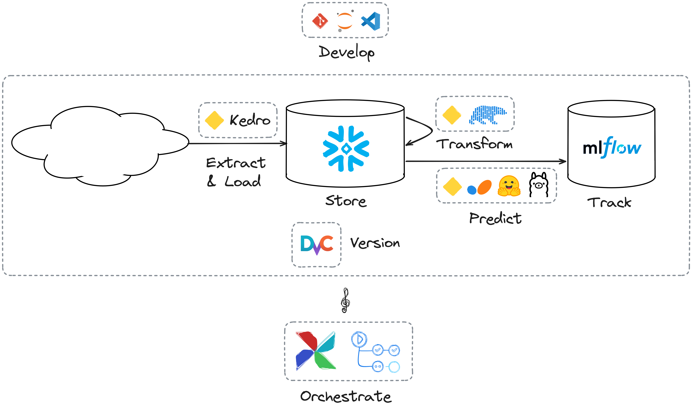

# MLOps with Kedro

1. Experiment tracking with Kedro and MLflow
2. Data and pipeline versioning with Kedro and DVC
3. Pipeline orchestration
   - Kedro on Airflow
   - Kedro on GitHub CI

## 1. Experiment tracking with Kedro and MLflow

Documentation: https://docs.kedro.org/en/0.19.14/integrations/mlflow.html

Video: https://www.youtube.com/live/Az_6UKqbznw?si=L7A1xWPmKSfFSGj3

> [!NOTE]
> At the time of writing, `kedro-mlflow` is still not compatible with Kedro 1.0,
> see https://github.com/Galileo-Galilei/kedro-mlflow/pull/658

## 2. Data and pipeline versioning with Kedro and DVC

Documentation: https://docs.kedro.org/en/0.19.14/integrations/kedro_dvc_versioning.html

Video: https://www.youtube.com/live/N9zOw7kAZiI?si=A5cBHvI8nLOGjhY7

## 3. Pipeline orchestration

### Kedro on Airflow

Documentation https://docs.kedro.org/en/0.19.14/deployment/airflow.html

Video: https://www.youtube.com/live/C4N71-NtY00?si=Wn3hPH6x4aPRHtQ3 (Airflow part towards minute 24)

### Kedro on GitHub Actions

(TBC)
