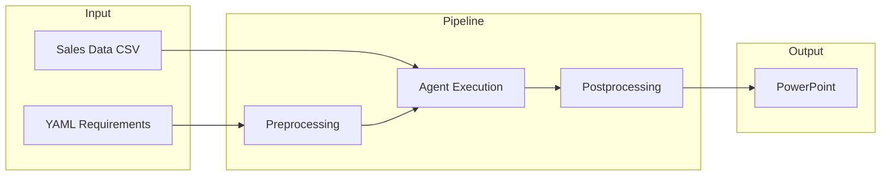
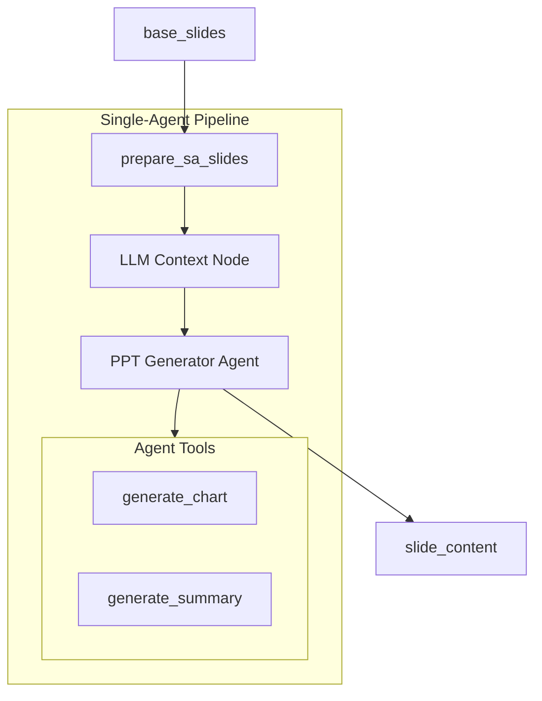
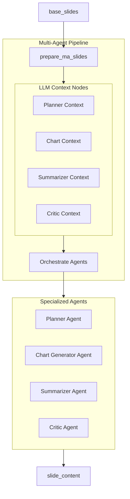
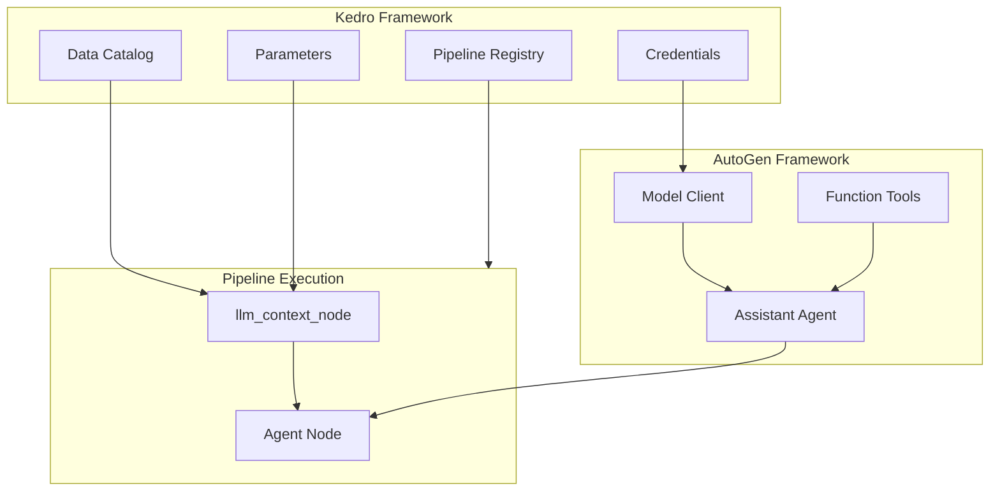
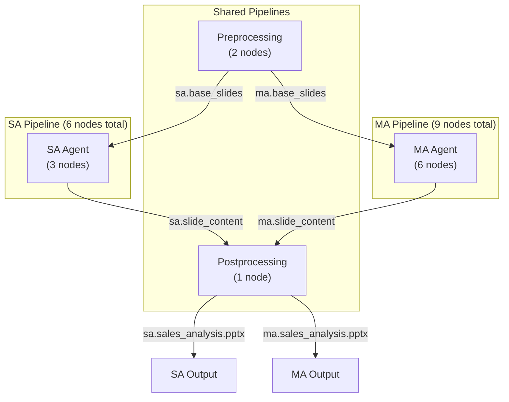

# Kedro PPT AutoGen Workflow

This project demonstrates combining **AutoGen** and **Kedro** for automated PowerPoint presentation generation. It transforms structured YAML instructions into professional presentations by leveraging LLM agents for chart creation and summary generation.

## Overview

The workflow automates the creation of data-driven presentations by:
- Parsing slide requirements from YAML configuration
- Using AI agents to analyze data and generate charts
- Creating contextual summaries based on data insights
- Assembling final PowerPoint presentations



## Agentic Workflows

Two pipeline patterns are available for generating presentations:

### Single-Agent (SA) Pipeline

A unified agent handles all content generation tasks using a comprehensive toolset.



**PPT Generator Agent**:
- Receives slide configurations with chart and summary instructions
- Calls `generate_chart` tool to create visualizations from data
- Calls `generate_summary` tool to create contextual bullet points
- Returns structured output for each slide

### Multi-Agent (MA) Pipeline

Specialized agents collaborate to produce higher-quality content through separation of concerns.



**Agent Responsibilities**:

| Agent | Role | Tools |
|-------|------|-------|
| **Planner** | Analyzes requirements, plans slide structure | `analyze_data` |
| **Chart Generator** | Creates data visualizations | `generate_chart` |
| **Summarizer** | Generates insight bullet points | `generate_summary` |
| **Critic** | Reviews quality, provides feedback | QA tools |

## Kedro + AutoGen Integration



**Kedro manages**:
- Data access through the catalog (sales data, prompts, intermediate outputs)
- Credentials for LLM API access
- Pipeline orchestration with namespace isolation
- Parameter configuration (styling, layout, QA settings)
- Logging and reproducibility

**AutoGen provides**:
- `AssistantAgent` for LLM-powered reasoning
- Function tools for data analysis and chart generation
- Structured output parsing via Pydantic models
- Async execution for agent invocations

## Project Structure

```
├── conf/
│   ├── base/
│   │   ├── catalog.yml          # Dataset definitions
│   │   ├── parameters.yml       # Pipeline parameters
│   │   └── genai-config.yml     # LLM + prompt configuration
│   └── local/                   # Local credentials (gitignored)
│       └── credentials.yml
│
├── data/
│   └── ppt_generation/
│       ├── sample/              # Input data
│       │   ├── slide_generation_requirements.yaml
│       │   └── sales_50_products.csv
│       ├── prompts/             # Prompt templates
│       │   ├── ma/              # Multi-agent prompts (8 files)
│       │   └── sa/              # Single-agent prompts (2 files)
│       ├── intermediate/        # Intermediate outputs
│       │   ├── ma/
│       │   │   ├── slide_definitions.json
│       │   │   ├── base_slides.json
│       │   │   ├── slide_configs.json
│       │   │   └── slide_content.json
│       │   └── sa/
│       │       ├── slide_definitions.json
│       │       ├── base_slides.json
│       │       ├── slide_configs.json
│       │       └── slide_content.json
│       └── output/              # Final presentations
│           ├── ma/
│           │   └── sales_analysis.pptx
│           └── sa/
│               └── sales_analysis.pptx
│
└── src/ppt_autogen_workflow/
    ├── base/                    # Shared infrastructure
    │   ├── __init__.py          # Exports base classes and utilities
    │   ├── agent.py             # BaseAgent with structured output support
    │   ├── output_models.py     # Pydantic models (ChartOutput, SummaryOutput, etc.)
    │   ├── tools.py             # Shared tool builders (data analysis, chart, summary)
    │   └── utils.py             # Shared utilities
    │
    ├── datasets/
    │   └── autogen_model_client.py  # LLM client dataset
    │
    ├── pipelines/
    │   ├── preprocessing/       # Shared preprocessing (2 nodes)
    │   │   ├── __init__.py
    │   │   ├── nodes.py         # parse_slide_instructions, extract_slide_objectives
    │   │   └── pipeline.py
    │   │
    │   ├── postprocessing/      # Shared postprocessing (1 node)
    │   │   ├── __init__.py
    │   │   ├── nodes.py         # assemble_presentation, create_slide, combine_presentations
    │   │   └── pipeline.py
    │   │
    │   ├── ma_slide_generation_autogen/  # MA agent pipeline (6 nodes)
    │   │   ├── __init__.py
    │   │   ├── agent.py         # PlannerAgent, ChartGeneratorAgent, SummarizerAgent, CriticAgent
    │   │   ├── nodes.py         # prepare_ma_slides, orchestrate_multi_agent_workflow
    │   │   ├── pipeline.py
    │   │   └── utils.py         # format_ma_prompts
    │   │
    │   └── sa_slide_generation_autogen/  # SA agent pipeline (3 nodes)
    │       ├── __init__.py
    │       ├── agent.py         # PPTGenerationAgent
    │       ├── nodes.py         # prepare_sa_slides, run_ppt_agent
    │       └── pipeline.py
    │
    ├── pipeline_registry.py     # Registers pipelines with namespace support
    └── settings.py
```

## Pipeline Architecture



### Node Breakdown

| Pipeline | Preprocessing | Agent Nodes | Postprocessing | Total |
|----------|--------------|-------------|----------------|-------|
| SA       | 2 (shared)   | 3           | 1 (shared)     | **6** |
| MA       | 2 (shared)   | 6           | 1 (shared)     | **9** |

## Required Data

### Input Files

| File | Description | Location |
|------|-------------|----------|
| Slide Requirements | YAML with slide objectives, chart/summary instructions | `data/ppt_generation/sample/slide_generation_requirements.yaml` |
| Sales Data | CSV with product sales data for analysis | `data/ppt_generation/sample/sales_50_products.csv` |

### Prompt Templates

| Agent | Files | Location |
|-------|-------|----------|
| SA - PPT Generator | System + User prompts | `data/ppt_generation/prompts/sa/` |
| MA - Planner | System + User prompts | `data/ppt_generation/prompts/ma/planner_*.yml` |
| MA - Chart Generator | System + User prompts | `data/ppt_generation/prompts/ma/chart_generator_*.yml` |
| MA - Summarizer | System + User prompts | `data/ppt_generation/prompts/ma/summarizer_*.yml` |
| MA - Critic | System + User prompts | `data/ppt_generation/prompts/ma/critic_*.yml` |

## Project Purpose

This initiative showcases:

- **Deterministic + Agentic separation**: Clear boundaries between preprocessing, agent execution, and postprocessing phases
- **Namespace isolation**: SA and MA pipelines run independently with separate data artifacts
- **Tool-based data access**: Agents query raw data dynamically rather than receiving pre-computed metrics
- **Structured outputs**: Pydantic models ensure reliable parsing of agent responses
- **Pipeline composition**: Shared preprocessing and postprocessing reused across pipeline variants
- **Kedro best practices**: Proper use of catalog, parameters, credentials, and pipeline registry

## Setup Instructions

### 1. Clone and Install

```bash
git clone <repository-url>
cd kedro-ppt-autogen-workflow

python -m venv .venv
source .venv/bin/activate  # Windows: .venv\Scripts\activate

pip install -r requirements.txt
```

### 2. Configure Credentials

Create `conf/local/credentials.yml`:

```yaml
openai:
  api_key: "${oc.env:OPENAI_API_KEY}"
  base_url: "${oc.env:OPENAI_API_BASE}"  # Optional
```

Export environment variables:

```bash
export OPENAI_API_KEY="your-api-key"
export OPENAI_API_BASE="your-base-url"  # Optional
```

### 3. Configure LLM Model

Edit `conf/base/genai-config.yml`:

```yaml
llm_autogen:
  type: ppt_autogen_workflow.datasets.autogen_model_client.OpenAIChatCompletionClientDataset
  kwargs:
    model: "gpt-4o"
    temperature: 1
  credentials: openai
```

### 4. Run Pipelines

```bash
# Single-Agent Pipeline (faster)
kedro run --pipeline=sa_slide_generation_autogen

# Multi-Agent Pipeline (more sophisticated)
kedro run --pipeline=ma_slide_generation_autogen

# Both pipelines
kedro run

# Run by namespace
kedro run --namespace sa
kedro run --namespace ma
```

### 5. Check Outputs

| Output | Location |
|--------|----------|
| SA Presentation | `data/ppt_generation/output/sa/sales_analysis.pptx` |
| MA Presentation | `data/ppt_generation/output/ma/sales_analysis.pptx` |
| Intermediate Files | `data/ppt_generation/intermediate/{sa,ma}/` |

## Prompt Management

Prompts are stored as YAML files and loaded via Kedro's GenAI configuration:

```
data/ppt_generation/prompts/
├── sa/
│   ├── ppt_generator_system.yml    # SA agent system prompt
│   └── ppt_generator_user.yml      # SA agent user prompt template
└── ma/
    ├── planner_system.yml          # Planner system prompt
    ├── planner_user.yml            # Planner user template
    ├── chart_generator_system.yml  # Chart agent system prompt
    ├── chart_generator_user.yml    # Chart agent user template
    ├── summarizer_system.yml       # Summarizer system prompt
    ├── summarizer_user.yml         # Summarizer user template
    ├── critic_system.yml           # Critic system prompt
    └── critic_user.yml             # Critic user template
```

Prompts are registered in `conf/base/genai-config.yml` and injected into agents via `llm_context_node`.

## Configuration

### Parameters (`conf/base/parameters.yml`)

```yaml
styling:
  brand_color: "#1F4E79"
  chart_colors: ["#1F4E79", "#D0582A", "#70AD47", ...]
  title_size: 28
  text_size_small: 11

layout:
  chart_width: 5.0
  chart_height: 5.0
  summary_width: 4.0

quality_assurance:
  quality_standards: "Professional presentation standards..."
  review_criteria: "Score 1-10, check alignment..."
```

### Catalog (`conf/base/catalog.yml`)

Uses namespace templating for SA/MA isolation:

```yaml
"{namespace}.slide_generation_requirements":
  type: yaml.YAMLDataset
  filepath: data/ppt_generation/sample/slide_generation_requirements.yaml

"{namespace}.sales_data":
  type: pandas.CSVDataset
  filepath: data/ppt_generation/sample/sales_50_products.csv

"{namespace}.slide_content":
  type: json.JSONDataset
  filepath: data/ppt_generation/intermediate/{namespace}/slide_content.json
```

## Visualizing Pipelines

Run Kedro-Viz to explore the pipeline structure:

```bash
kedro viz
```
