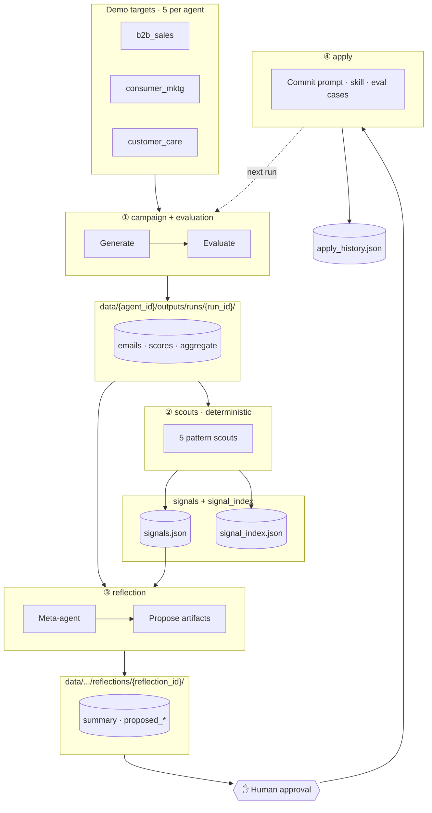

# kedro-reflection-agent — design

Working document for engineers. Captures the agreed shape of the demo and tracks what has been implemented.

**Audience:** implementation detail, catalogs, pipelines, UI wiring.  
**Partner / executive narrative:** [`docs/Architecture.md`](docs/Architecture.md).

---

## Implementation status

| Component | Status | Notes |
| --- | --- | --- |
| `campaign` pipeline | ✅ | Generates agent outputs + run metadata; optional Langfuse trace per case |
| `evaluation` pipeline | ✅ | Langfuse `run_experiment(...)` + disk scores; per-agent judge dimensions |
| `scouts` pipeline | ✅ | Five pattern scouts; per-run `signals.json` + cross-agent `signal_index.json` |
| `reflection` pipeline | ✅ | Meta-agent proposes prompt, skill, eval cases |
| `apply` pipeline | ✅ | Commits approved proposal; append-only `apply_history.json` |
| `RunIndexHook` | ✅ | Cross-run audit index after each pipeline |
| `b2b_sales` agent | ✅ | End-to-end with seed + eval + Langfuse labels |
| `consumer_mktg` agent | ✅ | Same pipeline shape; agent-specific models and rubrics |
| `customer_care` agent | ✅ | Same pipeline shape; agent-specific models and rubrics |
| Streamlit UI | ✅ | Org Overview + Campaigns (4 stages); Kedro-Viz + optional Langfuse |
| Portfolio Intelligence | ✅ | Org Overview reads run index, scores, signals (richer as runs accumulate) |
| `docs/ui/*.html` | 📐 mock | Static design prototypes; **Streamlit is the live demo** |

**Demo scale:** `make seed N=5` loads **5 targets per agent** (15 total). Architecture supports many more cases per BU.

---

## What this demo shows

Three telco business-unit agents share one **five-pipeline Kedro loop**. Each agent is seeded with a deliberately weak v1 prompt/skill so evaluation and reflection produce a visible improvement after human approval.

The invariant cycle:

`campaign + evaluation + scouts (run_1) → reflection → apply → campaign + evaluation (run_2)`.

Adding another agent is primarily **configuration** under `data/{agent_id}/` plus Langfuse prompt/dataset names—not new pipeline code.

---

## End-to-end flow

```
  shared seed + per-agent targets
           │
           ▼
  ┌────────────────┐
  │   campaign     │──▶ outputs per case (disk) + traces (Langfuse)
  └───────┬────────┘
          ▼
  ┌────────────────┐
  │  evaluation    │──▶ per_case_scores + aggregate_scores (disk + Langfuse experiment)
  └───────┬────────┘
          ▼
  ┌────────────────┐
  │    scouts      │──▶ signals.json (per run) + signal_index.json (cross-agent)
  └───────┬────────┘
          ▼
  ┌────────────────┐
  │  reflection    │──▶ proposed prompt / skill / eval cases
  └───────┬────────┘
          ▼
       ✋ human approval (UI)
          ▼
  ┌────────────────┐
  │     apply      │──▶ live prompt (Langfuse), skill (disk), eval cases, audit row
  └────────────────┘
```

### Journey (pipeline-centric)



---

## Data layout

| Path | Purpose |
| --- | --- |
| `data/shared/seed/customers.json` | 20 fictional customers (shared FK) |
| `data/shared/seed/products.json` | 15 fictional products |
| `data/{agent_id}/seed/customer_profiles.json` | BU-specific customer enrichment |
| `data/{agent_id}/seed/product_details.json` | BU-specific product enrichment |
| `data/{agent_id}/seed/targets.json` | Campaign cases (`case_id`, `customer_id`, `product_id`) |
| `data/{agent_id}/campaign/prompts/` | System prompt seed ↔ Langfuse |
| `data/{agent_id}/campaign/skills/` | Style guide markdown |
| `data/{agent_id}/evaluation/` | Eval cases + judge prompt |
| `data/{agent_id}/outputs/runs/{run_id}/` | Run artifacts (gitignored) |
| `data/{agent_id}/outputs/reflections/{reflection_id}/` | Proposals (gitignored) |
| `data/outputs/run_index.json` | Cross-run index (`RunIndexHook`) |
| `data/outputs/signal_index.json` | Cross-agent scout log |
| `data/outputs/apply_history.json` | Append-only apply audit |

---

## Pipelines

### 1. `campaign`

Given campaign targets, generate one structured output per case (email, offer message, or care reply depending on `agent_id`).

| Inputs | Source |
| --- | --- |
| Shared customers / products | `data/shared/seed/` |
| Agent profiles / product details / targets | `data/{agent_id}/seed/` |
| System prompt | `data/{agent_id}/campaign/prompts/` ↔ Langfuse |
| Skill file | `data/{agent_id}/campaign/skills/{agent_id}_style.md` |
| `run_id`, `model_name`, `agent_id`, … | CLI / Streamlit / `parameters.yml` |

| Outputs | Destination |
| --- | --- |
| Per-case outputs | `data/{agent_id}/outputs/runs/{run_id}/emails/{case_id}.json` |
| Run metadata | `.../run_metadata.json` |
| Traces (optional) | Langfuse (`campaign:{case_id}`) |

**Nodes:** `llm_context_node` → `prepare_agent_inputs_node` → `generate_emails_node`

Structured output via `ChatPromptTemplate | LLM.with_structured_output(EmailOutput)` (shared model name; content differs by agent).

---

### 2. `evaluation`

Runs a Langfuse experiment where the task is a **disk lookup** of the campaign output by `case_id` (scores match what the UI shows).

| Inputs | Source |
| --- | --- |
| Eval cases + rubrics | `data/{agent_id}/evaluation/eval_cases.json` ↔ Langfuse |
| Generated outputs | `.../runs/{run_id}/emails/` |
| Judge prompt | `data/{agent_id}/evaluation/prompts/` ↔ Langfuse |

| Outputs | Destination |
| --- | --- |
| Experiment + traces | Langfuse |
| `per_case_scores.json`, `aggregate_scores.json` | Per-run folder |

**Nodes:** `judge_context_node` → `init_heuristic_evaluators_node` → `init_judge_evaluator_node` → `make_campaign_task_node` → `run_experiment_node`

**Scoring:** four shared heuristics plus three LLM-judge dimensions for B2B (`writing_quality`, `personalization`, `groundedness`). Consumer and care agents swap judge field names via per-agent `JudgeScore` models—see `src/kedro_reflection_agent/models/{agent_id}/`.

Per-case mean is equal-weighted; `passing_threshold` (default `0.92`) controls `n_passing`.

---

### 3. `scouts`

Deterministic detectors between evaluate and reflect. No LLM calls.

| Scout | Triggers when… |
| --- | --- |
| `rubric_miss` | Rubric field not met on ≥ N cases |
| `score_regression` | Dimension drops vs rolling window |
| `hallucination_flag` | Forbidden mention / fabricated detail |
| `tone_drift` | Tone below floor for consecutive cases |
| `cross_unit_pattern` | Same signal type in ≥2 agents in window |

| Outputs | Destination |
| --- | --- |
| `signals` | `data/{agent_id}/outputs/runs/{run_id}/signals.json` |
| Index update (side effect) | `data/outputs/signal_index.json` |

**Node:** `run_scouts_node` — see `src/kedro_reflection_agent/pipelines/scouts/nodes.py`

Thresholds: `conf/base/parameters.yml` (`scout_*` keys).

---

### 4. `reflection`

Meta-agent reads scores, eval rubrics, current prompt/skill, and proposes replacements. **Does not write live artifacts**—only `apply` does.

| Outputs | Destination |
| --- | --- |
| `summary.md` | `.../reflections/{reflection_id}/` |
| `proposed_prompt.json` | Plain JSON (no Langfuse dataset type) for offline apply |
| `proposed_skill.md` | Same folder |
| `proposed_eval_cases.json` | Same folder |

**Nodes:** `meta_agent_context_node` → `prepare_reflection_context_node` → `reflect_node`

**Behaviour notes:**

- Skips experiment rows with no local email body.
- If nothing fails threshold, uses lowest-scoring cases so reflection always has input.
- Passes only the system message from the current prompt template into the meta-agent.

---

### 5. `apply`

Commits an approved `reflection_id`.

| Outputs | Destination |
| --- | --- |
| New prompt version | Langfuse (`{agent_id}-system-prompt`) |
| Skill file | `data/{agent_id}/campaign/skills/` (overwritten) |
| Eval cases | Langfuse dataset `{agent_id}-eval` |
| Audit row | `data/outputs/apply_history.json` |

**Node:** `commit_reflection_node`

---

## Streamlit dashboard

Entry point: `app/main.py` (`make app`).

| Page | Module | Purpose |
| --- | --- | --- |
| **Org Overview** | `app/pages/org_overview.py` | Portfolio: trends, issue matrix, cross-agent signals, leaderboards |
| **Campaigns** | `app/pages/campaign.py` | Per-agent pipeline observability (4 stages) |

Navigate: `?page=campaigns` for Campaigns; default is Org Overview.

### Campaigns — four stages

All stages live inside one **Pipeline Runs** card with tabs:

| Stage | Component | Pipelines (when Run clicked) |
| --- | --- | --- |
| ① Campaign & Evaluate | `app/components/stage_campaign.py` | `campaign`, `evaluation` |
| ② Scouts | `app/components/stage_scouts.py` | `scouts` |
| ③ Reflect & Propose | `app/components/stage_reflect.py` | `reflection` |
| ④ Approve & Apply | `app/components/stage_approve.py` | `apply` (+ compare runs) |

Each stage sub-tabs: **Kedro-Viz** · **Run Logs** · **Langfuse** (optional).

**Runner:** `app/runner.py` wraps `kedro run` with streamed logs for UI buttons.

**State:** `app/state.py` + `data/demo_state.json` track demo progression; `scripts/seed_demo.py` resets baselines and clears cached Streamlit data via `seed_at`.

**Legacy:** `app/components/step_*.py` are unused; the live UI uses `stage_*.py` only.

### Langfuse panel

`app/embeds.py`, `app/langfuse_analytics.py` — metrics, score charts, traces when `conf/local/credentials.yml` is configured. Not required for core Kedro demo paths.

---

## Agents

| `agent_id` | Output | Judge dimensions (LLM) |
| --- | --- | --- |
| `b2b_sales` | Enterprise outreach emails | writing_quality, personalization, groundedness |
| `consumer_mktg` | Plan & device upgrade offers | offer_relevance, personalisation, urgency_cta, tone, compliance |
| `customer_care` | Support reply suggestions | empathy_opener, resolution_clarity, tone, compliance, escalation_avoidance |

Shared heuristics (all agents): `subject_present`, `length_in_range`, `no_fake_skus`, `cta_present` (implementations may vary slightly by output shape).

---

## Conventions

- **`agent_id`** is mandatory on every `kedro run` (no default in `parameters.yml`).
- **`run_id`** — demo uses `run_1` (before apply) and `run_2` (after).
- **`reflection_id`** — demo uses `refl_1`.
- **Catalog split** — `conf/base/catalog_{pipeline}.yml` per pipeline; `{default_dataset}` in `catalog.yml`.
- **Langfuse sync** — `sync_policy: local` on datasets/prompts; push on apply.
- **UI scores** — filtered to locally generated case IDs in `per_case_scores.json`.
- **Models** — `src/kedro_reflection_agent/models/shared/` and `models/{agent_id}/`.

---

## Headless demo cycle

```bash
make run-cycle   # b2b_sales: campaign → evaluation → scouts → reflection → apply → campaign → evaluation
```

Or per pipeline — see README.md.

---

## Out of scope

- Real telco / PII data
- Closed-loop auto-apply without human approval
- Multi-turn conversational agents
- Production deployment, multi-tenancy, HA
