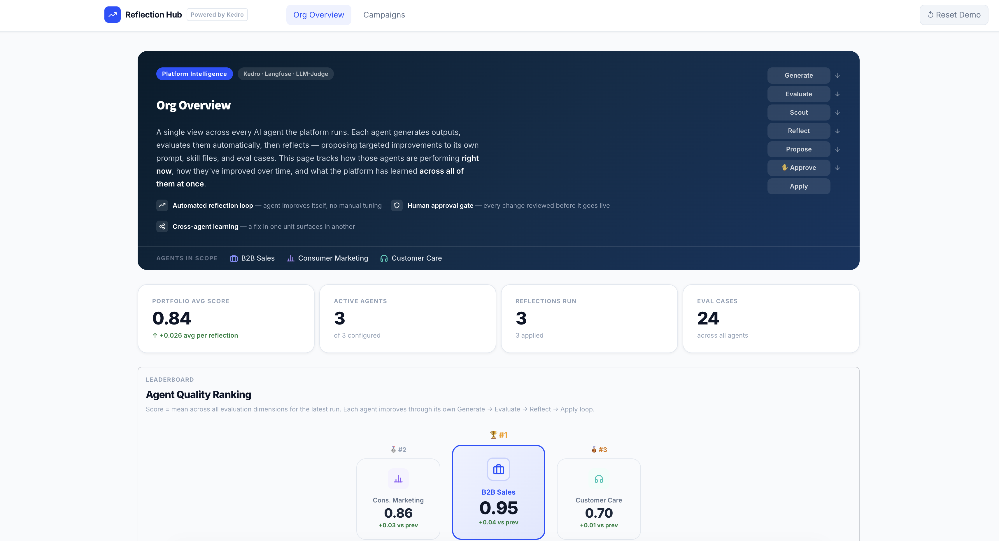

# Reflection Hub

[](https://kedro.org)

**Enterprise self-improving AI agents, orchestrated with Kedro.** One platform investment, three business units in this demo, governance built in.




---

One platform runs the same governed loop for three business units: generate, evaluate, scout, reflect, approve, apply. This repository is a proof-of-concept with a Streamlit front end and synthetic data.

| Document | Audience |
| --- | --- |
| [`docs/Architecture.md`](docs/Architecture.md) | Executive |
| [`DESIGN.md`](DESIGN.md) | Technical |
| [`docs/ui/`](docs/ui/) | Static HTML mocks |

---

## Quick start

- Requires [uv](https://docs.astral.sh/uv/).
- Requires Langfuse for tracing

  **Self-hosted Langfuse (Podman):**
  ```bash
  podman machine init && podman machine start
  git clone https://github.com/langfuse/langfuse.git && cd langfuse
  podman-compose up -d
  curl http://localhost:3000/api/public/health   # → {"status":"ok"}
  # Set host: http://localhost:3000 in credentials.yml
  ```

- Project setup and run

  ```bash
  make setup
  cp conf/local/credentials.yml.example conf/local/credentials.yml
  # Required: openai.api_key
  # Langfuse traces / prompt registry): langfuse_credentials
  make app
  ```

Open **http://localhost:8501/** (Org Overview) or **http://localhost:8501/?page=campaigns** (per-agent pipeline stages).


---

**Pre-run:** use `make run-cycle` so the UI shows scores and proposals without live LLM calls (for b2b_sales).

**Reset demo data:**

```bash
make seed              # all 3 agents, 20 cases each
make seed N=3          # fewer cases per agent
make seed AGENT=b2b_sales # seed only specific agent
```

---

## Usage

| Command | Description |
| --- | --- |
| `make app` | Streamlit UI (`app/main.py`) |
| `make viz` | Kedro-Viz pipeline graph |
| `make run-cycle` | Full headless cycle for `b2b_sales` |

**Manual pipelines** (`agent_id` is required):

```bash
uv run kedro run --pipelines campaign,evaluation,scouts \
  --params "agent_id=b2b_sales,run_id=run_1"
```

More commands and parameters: [`DESIGN.md`](DESIGN.md).

**Optional Langfuse** — one dataset and prompts per agent (e.g. `b2b_sales-eval`, `b2b_sales-system-prompt`). Seed files live under `data/{agent_id}/`. Langfuse is a bonus observability layer; Kedro outputs on disk drive the UI.

---

## Project layout (abbreviated)

```
kedro-reflection-agent/
├── app/                    # Streamlit UI
├── conf/base/              # Kedro catalog + parameters
├── data/
│   ├── shared/seed/        # 20 customers, 15 products
│   └── {agent_id}/         # per-BU seed, prompts, outputs/
├── docs/
│   ├── Architecture.md     # executive + demo script
│   ├── images/             # screenshots (you add)
│   └── ui/                 # HTML prototypes
├── src/kedro_reflection_agent/pipelines/
│   campaign · evaluation · scouts · reflection · apply
├── DESIGN.md
├── scripts/seed_demo.py
└── Makefile
```

---

## Agents (demo)

| Agent | Role |
| --- | --- |
| B2B Sales | Enterprise outreach emails |
| Consumer Marketing | Plan & device upgrade offers |
| Customer Care | Support reply suggestions |

**Demo scale:** 5 scenarios × 3 agents on synthetic data; the Kedro loop scales to larger batch sizes without structural change.
