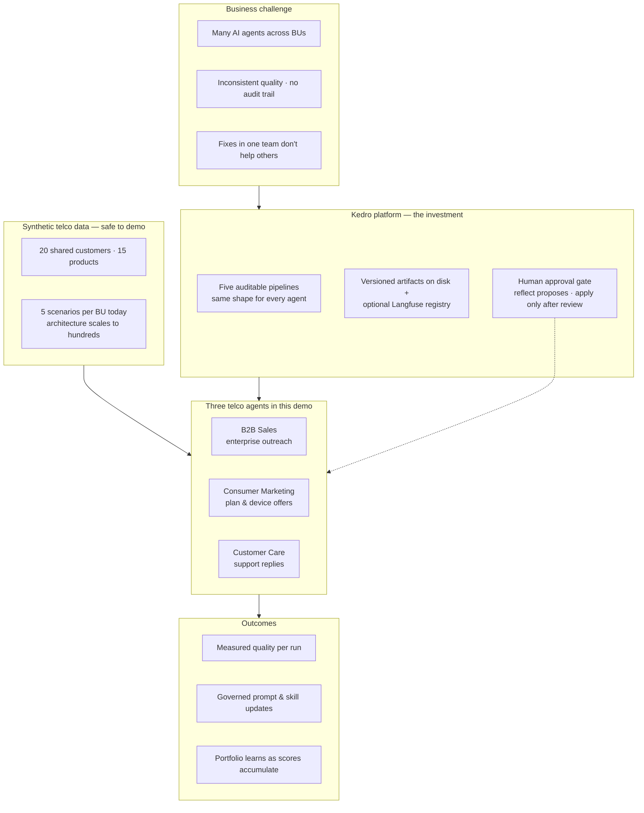
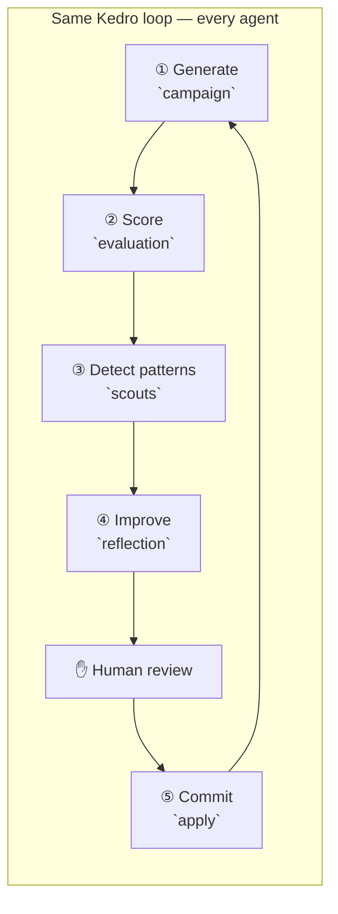
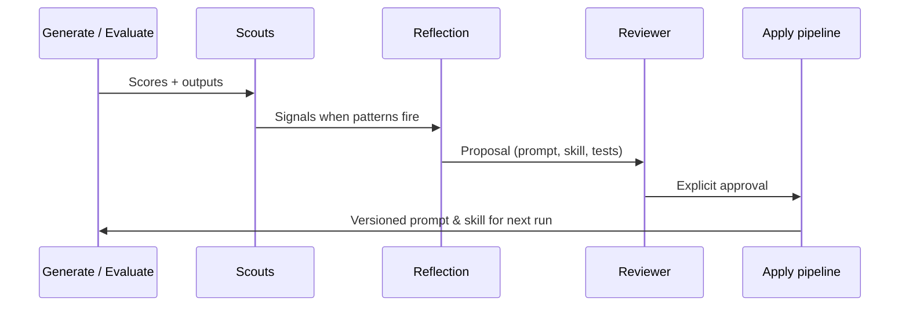

# Reflection Hub — Architecture

> **Enterprise self-improving AI agents, orchestrated with Kedro.**  
> One platform investment, three business units in this demo, governance built in.

This document is written for an overview of the product. It explains the problem, how Kedro makes the approach repeatable at scale. For pipeline nodes, catalogs, and code-level detail, see [`DESIGN.md`](../DESIGN.md) at the repository root.

---

## Overview

Telco teams are deploying AI agents across sales, marketing, and care. Without a shared platform, each team rebuilds evaluation, change control, observability and improvements stay siloed. **Reflection Hub** shows the opposite: **one Kedro-shaped loop** per agent, **human approval** before any change goes live, and a **portfolio layer** that surfaces quality and cross-unit patterns as runs accumulate.

**How to read this diagram:** Kedro is not a side detail, it is how generation, evaluation, scouting, reflection, and apply stay **structured, repeatable, and inspectable**.

---

## The problem

| Pain | What goes wrong |
|------|-----------------|
| **Fragmentation** | Each BU ships its own agent stack; evaluation and governance are reinvented. |
| **Opaque change** | Prompt and policy updates are hard to trace; rollbacks are risky. |
| **Siloed learning** | A failure mode fixed in sales does not become a test case—or a signal—for marketing or care. |

Reflection Hub addresses these with a **single loop** and **explicit gates**, not ad-hoc scripts.

---

## How Kedro solves it

Kedro treats each step of the agent lifecycle as a **pipeline** with declared inputs and outputs. That gives enterprise teams:

1. **Write-once pipelines** — The same five pipelines run for B2B Sales, Consumer Marketing, and Customer Care. The pipeline code never changes between agents; only `agent_id` and the files under `data/{agent_id}/` differ. This is Kedro's core value here: the governed loop is a reusable asset, not a per-team script.
2. **Auditability** — Every run writes structured outputs under `data/{agent_id}/outputs/`; a cross-run index records what ran and when (using Kedro hooks).
3. **Safe improvement** — Reflection **proposes** changes; a human **approves**; only then does the **apply** pipeline commit prompts, skills, and regression cases.
4. **Inspectable operations** — Kedro-Viz in the UI shows the graph; run logs show exact CLI commands.

**Adding a fourth agent** is primarily configuration: new data files under `data/{agent_id}/`, prompts, and eval cases—not a rewrite of pipeline code.

| What you add | What you reuse |
|---|---|
| `data/{agent_id}/seed/` — targets, customer profiles, product details | All five Kedro pipelines unchanged |
| `data/{agent_id}/campaign/prompts/` + `skills/` | Shared customers and products in `data/shared/` |
| `data/{agent_id}/evaluation/eval_cases.json` + judge prompt | `RunIndexHook`, `signal_index.json`, `apply_history.json` |
| Per-agent `JudgeScore` model (LLM judge dimensions) | Scouts, reflection meta-agent, apply logic |

---

## Demo

In response to the feedback on the first demo that the next iteration should show how this scales beyond a single use case, surface patterns across the organisation, and present them in a usable UI, the project has been extended into Reflection Hub, powered by Kedro. It runs three customer-facing campaigns on the same self-improving loop: B2B Sales, Consumer Marketing, Customer Care and adds an org-level view on top.

The demo has two layers:

### 1. The campaign loop

Each campaign moves through the same four steps: **campaign & evaluate → scout → reflect & propose → approve & apply**.

- The agent drafts its work, scores it against domain rubrics, scouts its own traces and logs for failure patterns, proposes concrete changes, and waits for human approval.
- Performance is tracked across every run, so improvement is measurable over time.
- The same loop from the first demo now powers three campaigns instead of one.

### 2. The org overview

On top of the three campaigns sits a portfolio-level page:

- **Campaign quality ranking** — which campaigns are leading, which are lagging.
- **Failure patterns across campaigns** — failure modes that show up in more than one campaign are flagged as systemic.
- **Success path** — fixes that improved one campaign’s quality and are now travelling across the portfolio.
- **Applied changes log** — every approved prompt or skill change, by campaign, with audit trail.
- **Portfolio performance** — quality trend across every campaign over time, in one chart.

---

## Synthetic data (what "customers" mean here)

No real subscriber or account data is used.

| Layer | Content | Scale in this demo |
|-------|---------|-------------------|
| **Shared catalog** | Fictional telco customers and products | 20 customers, 15 products |
| **Per-agent enrichment** | Industry, tenure, care context, offer details | Joined to shared IDs |
| **Run targets** | Customer × product (or case) scenarios | **5 per agent** (15 total) |

v1 prompts and style guides are **deliberately mediocre** so evaluation and reflection produce a visible uplift after approval—without waiting for large batch jobs.

The architecture supports **hundreds of cases per BU**; this demo is intentionally small (**5×3**).

---

## Portfolio Intelligence (Org Overview)

The Org Overview page answers leadership questions:

| View | Question |
|------|----------|
| **Quality trend** | Which agents are improving, flat, or slipping? |
| **Issue patterns** | Which failure modes repeat? |
| **Cross-agent learning** | Do similar signals appear in more than one BU? |
| **Audit trail** | What was approved and applied? |

With five cases per agent, charts reflect **real pre-run scores** but are not statistically heavy. As teams run more cycles, the same views **light up** with richer history.

---

## How the system gets smarter across runs

Reflection is not a one-shot per-run operation. Each call to the `reflection` pipeline sees a growing body of evidence:

| Input to reflection | What it contains |
|---|---|
| `per_case_scores.json` (current run) | Dimension-level scores for every case this run |
| `aggregate_scores.json` (current run) | Mean, pass rate, trend vs previous run |
| `signals.json` (current run) | Scout findings: rubric misses, regressions, tone drift, hallucination flags |
| `signal_index.json` (cross-agent, all runs) | Every scout signal ever fired, across all agents and run IDs |
| `run_index.json` (all runs) | Full history of every pipeline run — agent, run ID, scores, timestamps |
| Current system prompt + skill file | What the agent is currently doing |
| Eval rubric + cases | The standards it is being held to |

**What this means in practice:**

- **Run 1 → Reflection** sees one run's scores and scouts. The meta-agent proposes improvements based on that snapshot.
- **Run 2 → Reflection** sees two runs of scores, a richer signal history, and whether the run_1 pattern persisted after apply. Proposals become more targeted.
- **Cross-agent learning** is surfaced through `signal_index.json`. If `tone_drift` fires for both `b2b_sales` and `consumer_mktg` in the same window, the `cross_unit_pattern` scout flags it — and reflection for either agent can see that this is systemic, not isolated.

The system does not retrain a model. It gets smarter the way an analyst does: each cycle, the meta-agent reads the full visible history and writes a more informed proposal. The richer that history, the more specific the prompt improvements it can justify.

---

## Governance and trust

- **Nothing goes live from reflection alone** — `apply` runs only after approval.
- **Append-only audit** — apply history and run index support governance questions.
- **Rollback story** — Prompt versions live in Langfuse when integrated; skills are versioned on disk.

---

## Why it matters

- **Scale.** One platform investment, three campaigns today, N tomorrow. New campaigns (Churn Save, Field Ops, Network Incident Comms) plug into the same loop.
- **Governance.** Nothing reaches production without human approval. Every change is versioned and auditable.
- **Compounding value.** Failures caught in one campaign become permanent regression tests there and surface opportunities for the others. The platform gets smarter as the portfolio grows.

## Bottom line

Reflection Hub turns three isolated agent projects into a single self-improving portfolio, with one place to see where the telco is improving, where it’s regressing, and which fixes should travel across teams.

## What this demo is — and is not

| In scope | Out of scope |
|----------|----------------|
| Kedro-orchestrated reflection loop | Production multi-tenancy or deployment |
| Three BU agents on synthetic data | Real telco CRM or PII |
| Streamlit UI | Unattended closed-loop auto-apply |

---

## Glossary

| Term | Meaning |
|------|---------|
| **Run** | One pass of generate + evaluate (and usually scouts), identified by `run_id` (e.g. `run_1`, `run_2`). |
| **Signal** | A scout record (e.g. rubric miss, score regression) feeding reflection. |
| **Reflection** | A meta-agent cycle that proposes—but does not publish—improvements. |
| **Apply** | Commits an approved reflection to live prompt, skill, and eval artifacts. |
| **Portfolio** | Cross-agent views on Org Overview driven by run index and shared stores. |

---

## Further reading

| Audience | Document |
|----------|----------|
| Technical | [`DESIGN.md`](../DESIGN.md) — pipelines, catalogs, models, UI components |
| Setup & run | [`README.md`](../README.md) — install, `make app`, screenshots |
| UI design history | [`docs/ui/`](ui/) — static HTML prototypes |
