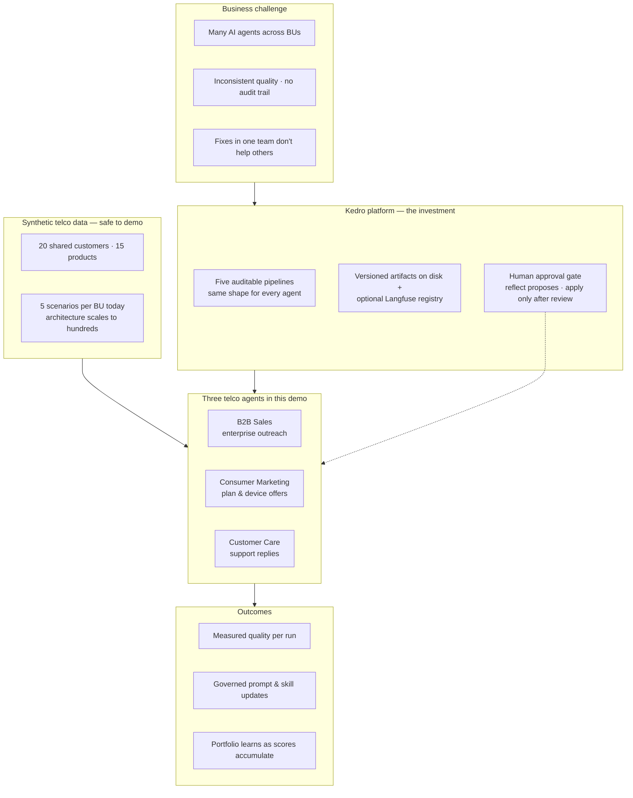
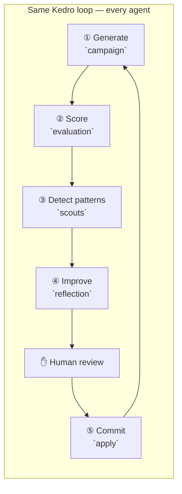
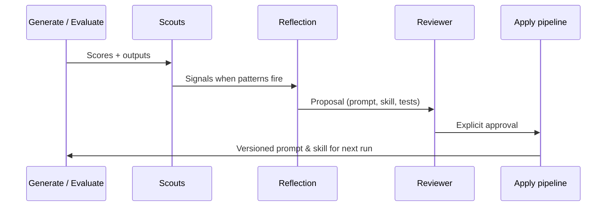

# Reflection Hub — Architecture

> **Enterprise self-improving AI agents, orchestrated with Kedro.**  
> One platform investment, three business units in this demo, governance built in.

This document is written for an overview of the product. It explains the problem, how Kedro makes the approach repeatable at scale. For pipeline nodes, catalogs, and code-level detail, see [`DESIGN.md`](../DESIGN.md) at the repository root.

---

## Overview

Telco teams are deploying AI agents across sales, marketing, and care. Without a shared platform, each team rebuilds evaluation, change control, observability and improvements stay siloed. **Reflection Hub** shows the opposite: **one Kedro-shaped loop** per agent, **human approval** before any change goes live, and a **portfolio layer** that surfaces quality and cross-unit patterns as runs accumulate.

**How to read this diagram:** Kedro is not a side detail, it is how generation, evaluation, scouting, reflection, and apply stay **structured, repeatable, and inspectable**.

---

## The problem

| Pain | What goes wrong |
|------|-----------------|
| **Fragmentation** | Each BU ships its own agent stack; evaluation and governance are reinvented. |
| **Opaque change** | Prompt and policy updates are hard to trace; rollbacks are risky. |
| **Siloed learning** | A failure mode fixed in sales does not become a test case—or a signal—for marketing or care. |

Reflection Hub addresses these with a **single loop** and **explicit gates**, not ad-hoc scripts.

---

## How Kedro solves it

Kedro treats each step of the agent lifecycle as a **pipeline** with declared inputs and outputs. That gives enterprise teams:

1. **Repeatability** — The same five pipelines run for B2B Sales, Consumer Marketing, and Customer Care; only configuration (`agent_id`, prompts, skills, evals, rubrics, data) changes.
2. **Auditability** — Every run writes structured outputs under `data/{agent_id}/outputs/`; a cross-run index records what ran and when (using kedro hooks).
3. **Safe improvement** — Reflection **proposes** changes; a human **approves**; only then does the **apply** pipeline commit prompts, skills, and regression cases.
4. **Inspectable operations** — Kedro-Viz in the UI shows the graph; run logs show exact CLI commands.

**Adding a fourth agent** is primarily configuration: new data files under `data/{agent_id}/`, prompts, and eval cases—not a rewrite of pipeline code.

---

## Demo

## Synthetic data (what "customers" mean here)

No real subscriber or account data is used.

| Layer | Content | Scale in this demo |
|-------|---------|-------------------|
| **Shared catalog** | Fictional telco customers and products | 20 customers, 15 products |
| **Per-agent enrichment** | Industry, tenure, care context, offer details | Joined to shared IDs |
| **Run targets** | Customer × product (or case) scenarios | **5 per agent** (15 total) |

v1 prompts and style guides are **deliberately mediocre** so evaluation and reflection produce a visible uplift after approval—without waiting for large batch jobs.

The architecture supports **hundreds of cases per BU**; this demo is intentionally small (**5×3**).

---

## Portfolio Intelligence (Org Overview)

The Org Overview page answers leadership questions:

| View | Question |
|------|----------|
| **Quality trend** | Which agents are improving, flat, or slipping? |
| **Issue patterns** | Which failure modes repeat? |
| **Cross-agent learning** | Do similar signals appear in more than one BU? |
| **Audit trail** | What was approved and applied? |

With five cases per agent, charts reflect **real pre-run scores** but are not statistically heavy. As teams run more cycles, the same views **light up** with richer history.

---

## Governance and trust

- **Nothing goes live from reflection alone** — `apply` runs only after approval.
- **Append-only audit** — apply history and run index support governance questions.
- **Rollback story** — Prompt versions live in Langfuse when integrated; skills are versioned on disk.

---

## Benefits of this approach

| Benefit | Summary |
|---------|----------------------------------|
| **Scale** | One Kedro platform; many BUs; add agents by configuration. |
| **Governance** | Human gate on every improvement; traceable runs. |
| **Compounding value** | Failures become regression tests; signals can surface across units. |

---

## What this demo is — and is not

| In scope | Out of scope |
|----------|----------------|
| Kedro-orchestrated reflection loop | Production multi-tenancy or deployment |
| Three BU agents on synthetic data | Real telco CRM or PII |
| Streamlit UI | Unattended closed-loop auto-apply |

---

## Glossary

| Term | Meaning |
|------|---------|
| **Run** | One pass of generate + evaluate (and usually scouts), identified by `run_id` (e.g. `run_1`, `run_2`). |
| **Signal** | A scout record (e.g. rubric miss, score regression) feeding reflection. |
| **Reflection** | A meta-agent cycle that proposes—but does not publish—improvements. |
| **Apply** | Commits an approved reflection to live prompt, skill, and eval artifacts. |
| **Portfolio** | Cross-agent views on Org Overview driven by run index and shared stores. |

---

## Further reading

| Audience | Document |
|----------|----------|
| Technical | [`DESIGN.md`](../DESIGN.md) — pipelines, catalogs, models, UI components |
| Setup & run | [`README.md`](../README.md) — install, `make app`, screenshots |
| UI design history | [`docs/ui/`](ui/) — static HTML prototypes |
