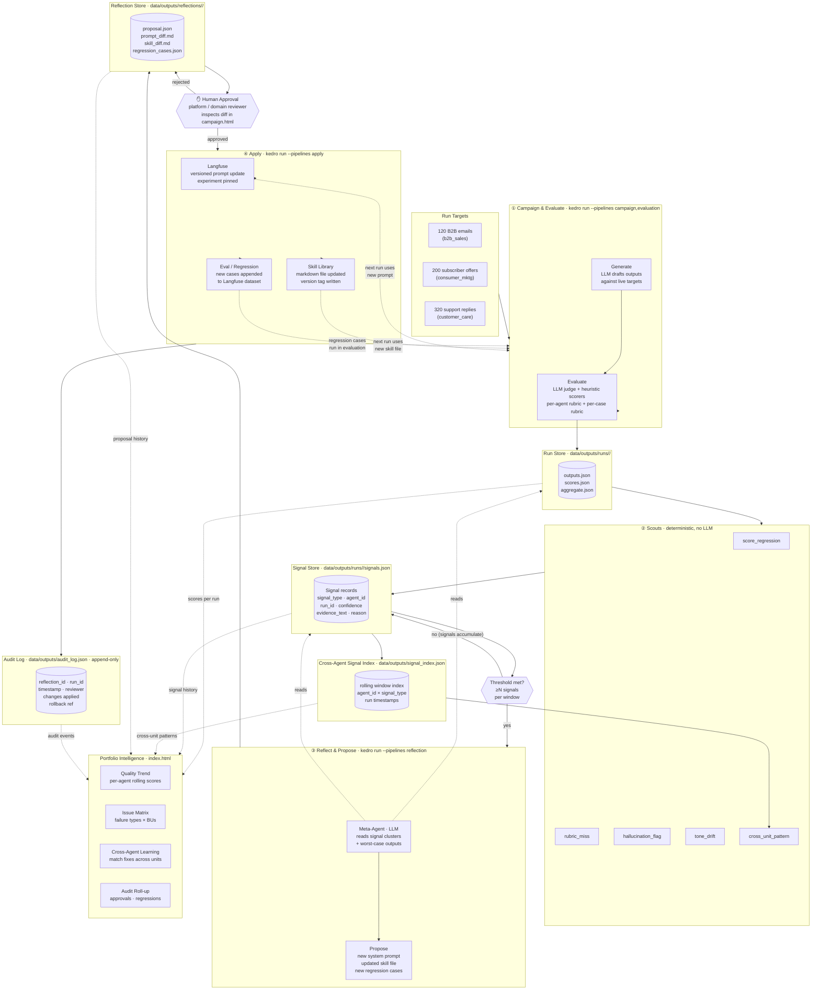

# Reflection Hub — Enterprise Architecture

> **Self-improving agent platform for telco.**  
> One platform investment, N business units. Governance built in. Value compounds as the portfolio grows.

---

## UI — Running Locally

All HTML prototypes live in `docs/ui/`. Start the dev server from the project root:

```bash
# Python (no install required)
python -m http.server 8080 --directory docs/ui

# or use the helper script
python docs/serve.py
```

Then open **http://localhost:8080/index.html**

### Page Index — POC (2 pages)

| Page | File | Description |
|---|---|---|
| **Org Overview** | `index.html` | Summary Cards, Leaderboard, Trends, Cross-Agent Learning, Issue Matrix, Success Matrix
| **Campaigns** | `campaign.html` | Agent selector (B2B Sales / Consumer Marketing / Customer Care), 4-stage Pipeline Observability (Campaign & Evaluate → Scouts → Reflect & Propose → Approve & Apply), each stage with Kedro-Viz / Run Logs / Langfuse sub-tabs, Multi-run Insights |

---

## Journey at a Glance



---

## System Layers

```
                    ╔══════════════════════════════════════════════════════════════════════╗
                    ║              PORTFOLIO INTELLIGENCE LAYER                            ║
                    ║              Platform Team  ·  Leadership                            ║
                    ║                                                                      ║
                    ║  ┌──────────────────┐ ┌─────────────────┐ ┌──────────────────────┐   ║
                    ║  │ Quality Trend    │ │  Issue Matrix   │ │ Cross-Agent Learning │   ║
                    ║  │ per agent ·      │ │ failure types × │ │ match fixes across   │   ║
                    ║  │ rolling runs     │ │ business units  │ │ units; flag systemic │   ║
                    ║  └──────────────────┘ └─────────────────┘ └──────────────────────┘   ║
                    ║  ┌──────────────────────────────────────────────────────────────┐    ║
                    ║  │  Audit Roll-up · approvals · regressions · rollbacks         │    ║
                    ║  └──────────────────────────────────────────────────────────────┘    ║
                    ╚════════════╤══════════════════╤═══════════════════╤══════════════════╝
                     scores ↑    │      scores ↑    │     scores ↑      │
                     proposals ↓ │      proposals ↓ │     proposals ↓   │
        ┌────────────────────────▼──┐ ┌─────────────▼──────────────┐ ┌──▼─────────────────────────┐
        │      B2B SALES AGENT      │ │  CONSUMER MARKETING AGENT  │ │   CUSTOMER CARE AGENT      │
        │  Enterprise outreach      │ │  Plan & device offers      │ │   Support reply suggestions│
        │                           │ │                            │ │                            │
        │  ┌────────┐               │ │  ┌────────┐                │ │  ┌────────┐                │
        │  │Generate│               │ │  │Generate│                │ │  │Generate│                │
        │  └───┬────┘               │ │  └───┬────┘                │ │  └───┬────┘                │
        │      ▼                    │ │      ▼                     │ │      ▼                     │
        │  ┌──────────┐             │ │  ┌──────────┐              │ │  ┌──────────┐              │
        │  │ Evaluate │             │ │  │ Evaluate │              │ │  │ Evaluate │              │
        │  └───┬──────┘             │ │  └───┬──────┘              │ │  └───┬──────┘              │
        │      ▼                    │ │      ▼                     │ │      ▼                     │
        │  ┌──────────┐             │ │  ┌──────────┐              │ │  ┌──────────┐              │
        │  │  Scouts  │→ signals    │ │  │  Scouts  │→ signals     │ │  │  Scouts  │→ signals     │
        │  └───┬──────┘             │ │  └───┬──────┘              │ │  └───┬──────┘              │
        │      ▼ (threshold met)    │ │      ▼ (threshold met)     │ │      ▼ (threshold met)     │
        │  ┌─────────┐              │ │  ┌─────────┐               │ │  ┌─────────┐               │
        │  │ Reflect │              │ │  │ Reflect │               │ │  │ Reflect │               │
        │  └───┬─────┘              │ │  └───┬─────┘               │ │  └───┬─────┘               │
        │      ▼                    │ │      ▼                     │ │      ▼                     │
        │  ┌─────────┐              │ │  ┌─────────┐               │ │  ┌─────────┐               │
        │  │ Propose │              │ │  │ Propose │               │ │  │ Propose │               │
        │  └───┬─────┘              │ │  └───┬─────┘               │ │  └───┬─────┘               │
        │      ▼                    │ │      ▼                     │ │      ▼                     │
        │  ┌────────────────────┐   │ │  ┌────────────────────┐    │ │  ┌────────────────────┐    │
        │    ✋ Human Approval             ✋ Human Approval              ✋ Human Approval        |
        │  └───┬────────────────┘   │ │  └───┬────────────────┘    │ │  └───┬────────────────┘    │
        │      ▼                    │ │      ▼                     │ │      ▼                     │
        │  ┌────────┐               │ │  ┌────────┐                │ │  ┌────────┐                │
        │  │ Apply  │               │ │  │ Apply  │                │ │  │ Apply  │                │
        │  └────────┘               │ │  └────────┘                │ │  └────────┘                │
        └───────────────────────────┘ └────────────────────────────┘ └────────────────────────────┘
                    │                              │                              │
                    └──────────────────────────────┼──────────────────────────────┘
                                                   │
                    ╔══════════════════════════════▼════════════════════════════════════════╗
                    ║                   SHARED PLATFORM SERVICES                            ║
                    ║                                                                       ║
                    ║  ┌─────────────────────┐  ┌──────────────────┐  ┌────────────────┐    ║
                    ║  │   Prompt Registry   │  │  Skill Library   │  │  Eval Framework│    ║
                    ║  │  Langfuse · versioned  │  markdown · v'd  │  │  judge+heurist.│    ║
                    ║  └─────────────────────┘  └──────────────────┘  └────────────────┘    ║
                    ║  ┌─────────────────────┐  ┌──────────────────┐  ┌────────────────┐    ║
                    ║  │    Audit Log        │  │   Orchestration  │  │  Regression    │    ║
                    ║  │  append-only · JSON │  │      Kedro       │  │  Test Bank     │    ║
                    ║  └─────────────────────┘  └──────────────────┘  └────────────────┘    ║
                    ╚═══════════════════════════════════════════════════════════════════════╝
```

---

## Portfolio Intelligence — What It Surfaces

| View | Question answered | UI Page | Audience |
|---|---|---|---|
| **Quality Trend** | Who's improving, who's stalling, who's regressing? | `index.html` (agent leaderboard) | Leadership |
| **Issue Matrix** | Which failure modes are unit-specific vs. systemic across all three? | `index.html` (Issue Matrix card) | Platform team |
| **Cross-Agent Learnings** | When a fix in one unit matches an open failure in another, should it travel? | `index.html` (Cross-Agent Learning card) | Platform team |
| **Audit Roll-up** | What changed, when, who approved it, any rollbacks? | `campaign.html` (Approve & Apply stage) | Governance / Compliance |

---

## Agent Loop — Invariant Shape

Every agent follows the same seven-step loop. Adding a fourth agent is a configuration exercise, not an engineering project.

| Step | What happens | UI touchpoint |
|---|---|---|
| **Generate** | Agent drafts its work (emails, offers, reply suggestions) against live targets | `campaign.html` — Stage 1: Campaign & Evaluate |
| **Evaluate** | LLM judge + deterministic heuristics score each output against domain rubric | `campaign.html` — Stage 1: Langfuse sub-tab |
| **Scout** | Lightweight rule-based detectors scan outputs and emit signals (rubric miss, score regression, tone drift, …) | `campaign.html` — Stage 2: Scouts (Signals sub-tab) |
| **Reflect** | Meta-agent reads signal clusters and worst cases — only fires when signals exceed a threshold | `campaign.html` — Stage 3: Reflect & Propose |
| **Propose** | Improved system prompt, updated skill file, new regression cases written to disk | `campaign.html` — Stage 3: Proposal sub-tab |
| **Human Approval** | Platform/domain reviewer inspects the diff before anything goes live | `campaign.html` — Stage 4: Approve & Apply gate |
| **Apply** | Approved changes versioned into Langfuse; local files synced; audit row appended | `campaign.html` — Stage 4: Run Logs + Compare Responses |

---

## Pattern Scouts

Lightweight, rule-based detectors that sit between **Evaluate** and **Reflect**. Each scout watches for one narrow class of failure and emits a **Signal** — a structured record that accumulates across runs before the meta-agent engages.

**Signal contract:**

```
{
  signal_type:   string          # the scout's name, e.g. "score_regression"
  agent_id:      string          # which agent produced this
  run_id:        string          # which campaign run
  confidence:    high|medium|low
  evidence_text: string          # excerpt, capped at ~1500 chars
  reason:        string          # which rule fired, with the threshold value
}
```

### Built-in Scouts

| Scout | Triggers when… | Confidence |
|---|---|---|
| `rubric_miss` | Any rubric field (`expected_cta`, `required_mentions`, `forbidden_mentions`) not met on ≥2 cases | `high` |
| `score_regression` | Any scored dimension drops >10 pts vs. rolling 5-run average | `medium` / `high` if >20 pts |
| `hallucination_flag` | Forbidden mention or fabricated product detail detected by heuristic | `high` |
| `tone_drift` | Tone dimension falls below per-agent configured floor for ≥3 consecutive cases | `medium` |
| `cross_unit_pattern` | Same `signal_type` appearing in ≥2 BU agents within the same rolling window | `high` |

### Design Rules

- **Pure and deterministic.** No LLM calls, no network calls. Read everything from the run outputs and `parameters.yml`.
- **Run fast.** O(n) over outputs — designed to add negligible cost to every run.
- **Calibrate confidence.** Reserve `high` for unambiguous cases. A scout firing on >30% of runs will be dismissed as noise by the meta-agent and wastes LLM budget.
- **`reason` is self-contained.** The signal row must be understandable without surrounding context — quote the matched value, name the threshold, include the delta.

### Adding a Scout

Implement `detect(outputs, params) → list[Signal]` in `src/scouts/`, register it in `conf/base/parameters.yml` under `signal_types`, add tunable thresholds to `conf/base/parameters_scouts.yml`. The rest of the pipeline picks it up automatically — no changes to Evaluate, Reflect, or Propose.

---

## Storage & Data Layer

The UI cards in the Portfolio Intelligence layer (Issue Matrix, Quality Trend, Cross-Agent Learning, Multi-run Insights) all read from persistent stores that accumulate across runs. Here is what each store holds, who writes it, and who reads it.

| Store | Path | Written by | Read by | Notes |
|---|---|---|---|---|
| **Run Store** | `data/outputs/runs/<run_id>/` | Campaign + Evaluation pipelines | Scouts, Reflect, Portfolio Intelligence | `outputs.json` (raw drafts), `scores.json` (per-case dim scores), `aggregate.json` (run-level KPIs). POC uses flat JSON files — no DB needed at this scale. |
| **Signal Store** | `data/outputs/runs/<run_id>/signals.json` | Scout layer (per run) | Reflect (threshold check), Portfolio Intelligence (Issue Matrix) | One file per run. The Reflect step aggregates across the rolling window at invocation time. |
| **Cross-Agent Signal Index** | `data/outputs/signal_index.json` | `cross_unit_pattern` scout (appends on every run) | `cross_unit_pattern` scout (reads rolling window), Portfolio Intelligence (Cross-Agent Learning card) | Rolling log of `{agent_id, signal_type, run_id, timestamp}`. Required for the `cross_unit_pattern` scout to detect the same failure type appearing in ≥2 BUs. |
| **Reflection Store** | `data/outputs/reflections/<reflection_id>/` | Reflect + Propose pipelines | Human reviewer (campaign.html Stage 3), Apply pipeline, Portfolio Intelligence | `proposal.json`, `prompt_diff.md`, `skill_diff.md`, `regression_cases.json`. One directory per reflection cycle. |
| **Audit Log** | `data/outputs/audit_log.json` | Apply pipeline (append-only) | Portfolio Intelligence (Audit Roll-up), Governance | Append-only JSON array. Each entry: `{reflection_id, run_id, timestamp, reviewer, changes_applied, rollback_ref}`. Never mutated — only appended. |
| **Prompt Registry** | Langfuse (versioned, external) | Apply pipeline | Generate pipeline (runtime injection), Evaluate (judge prompt label) | Each prompt version is pinned to a `run_id`. Rollback = pin previous version. |
| **Skill Library** | `skills/<agent_id>_style.md` | Apply pipeline (file write + git tag) | Generate pipeline (injected at runtime) | Versioned on disk via git tags. One file per agent. |
| **Regression Test Bank** | Langfuse dataset (external) | Apply pipeline (append cases) | Evaluation pipeline (re-run regressions each cycle) | Grows automatically. A failure in one unit's run becomes a permanent test case for that agent. |

### Storage needs by UI card

| UI Card | Data needed | Freshness requirement |
|---|---|---|
| **Agent scorecards** (index.html) | `aggregate.json` from last N runs per agent | Stale OK — refreshed per run |
| **Quality Trend** (index.html) | `aggregate.json` across all runs for an agent, sorted by timestamp | Historical — append-only reads |
| **Issue Matrix** (index.html) | `signals.json` aggregated across agents and runs | Rolling window (last 5–10 runs) |
| **Cross-Agent Learning** (index.html) | `signal_index.json` — cross-BU signal matches | Rolling window |
| **Multi-run Insights** (campaign.html) | All `aggregate.json` files for the selected agent | Historical reads |
| **Audit Roll-up** (campaign.html Stage 4) | `audit_log.json` | Real-time append; reads always get latest |

> **POC approach**: all stores are flat JSON files on disk. No database is required for the current 3-agent, single-instance POC. If the platform scales to 10+ agents or concurrent runs, the natural migration is: Signal Store + Cross-Agent Index → SQLite or DuckDB; Prompt Registry + Test Bank stay in Langfuse.

---

## Shared Platform Services

| Service | Technology | Role |
|---|---|---|
| **Prompt Registry** | Langfuse (versioned) | Source of truth for all system prompts; supports rollback |
| **Skill Library** | Markdown files (versioned on disk) | Style guides injected at runtime per agent |
| **Evaluation Framework** | LLM judge + heuristic scorers | Shared infrastructure; per-agent judge config and dimensions — see note below |
| **Orchestration** | Kedro pipelines | Deterministic, auditable pipeline runs |
| **Audit Log** | Append-only JSON | Every apply event recorded with timestamp and reviewer |
| **Regression Test Bank** | Per-agent eval datasets (Langfuse) | Grows automatically; failures in one unit become permanent tests |

### Evaluation Framework — Two Levels of Rubric

The framework has **two distinct layers** that are often conflated:

**1. Shared infrastructure (identical across all agents)**

- `run_experiment()` Langfuse experiment runner
- Kedro evaluation pipeline shape and catalog pattern
- Heuristic scorer scaffold (4 pluggable slots)
- `AggregateScore` / `CaseScore` disk output schema

**2. Per-agent configuration (swapped at deploy time via `parameters.yml`)**

| Config | What changes | Example |
|---|---|---|
| `judge_prompt` label | The LLM judge's scoring criteria and dimension definitions | B2B: writing quality, personalisation, groundedness · Care: empathy opener, resolution clarity, escalation avoidance |
| `_JUDGE_NAMES` | The scorer names written to Langfuse and used in aggregation | `("writing_quality", "personalization", "groundedness")` → `("empathy", "resolution_clarity", "tone")` |
| Heuristic impls | Domain-specific structural checks | B2B: `subject_present`, `no_fake_skus` · Care: `empathy_opener_present`, `no_escalation_language` |
| Eval dataset | Separate Langfuse dataset per agent | `b2b_sales_eval` · `consumer_mktg_eval` · `customer_care_eval` |

**3. Per-case rubric (carried on every individual eval case)**

Each case in the Langfuse dataset includes a `rubric` field the judge and heuristics read at runtime:

```json
{
  "required_mentions": ["fleet management", "uptime SLA"],
  "forbidden_mentions": ["generic connectivity"],
  "expected_cta": "demo",
  "expected_tone": "consultative"
}
```

This enforces case-specific expectations *within* an agent's run without changing the pipeline code.

**Design intent:** the pipeline code does not change when adding a new agent. Only the Langfuse prompt label, scorer names, and heuristic implementations are swapped via config. The scoring contract (how results are stored, aggregated, and handed to the meta-agent) is invariant.

---

## Why This Architecture

**Scale** — One platform investment serves N business units. Evaluation, governance, and audit are not rebuilt per team.

**Governance built in** — No change touches production without a human approval gate. Every version is traceable.

**Compounding value** — A failure caught in one unit becomes a regression test there *and* surfaces an opportunity for the others. The platform gets smarter as the portfolio grows.

---

## File Layout (As of now)

```
docs/
├── enterprise-architecture.md   ← this file
├── serve.py                     ← dev server helper
└── ui/                          ← HTML prototypes (POC — 2 pages)
    ├── index.html               ← entry point / org overview
    └── campaign.html            ← campaigns page (all 3 agents)

data/outputs/                    ← runtime stores (git-ignored)
├── runs/
│   └── <run_id>/
│       ├── outputs.json         ← raw generated drafts
│       ├── scores.json          ← per-case dimension scores
│       ├── aggregate.json       ← run-level KPIs
│       └── signals.json         ← scout signals for this run
├── reflections/
│   └── <reflection_id>/
│       ├── proposal.json
│       ├── prompt_diff.md
│       ├── skill_diff.md
│       └── regression_cases.json
├── signal_index.json            ← rolling cross-agent signal log
└── audit_log.json               ← append-only audit trail
```

---

## Current Status

| Milestone | Status |
|---|---|
| Per-agent loop (B2B Sales) — end-to-end | ✅ Working |
| Consumer Marketing agent | ⬜ Next |
| Customer Care agent | ⬜ Next |
| Pattern Scouts — scout layer between Evaluate and Reflect | ⬜ Next |
| Portfolio Intelligence layer | ⬜ Next |
| Cross-agent learning engine | ⬜ Next |
| UI prototype — Org Overview + Campaign pages (2 pages) | ✅ Complete (`docs/ui/`) |
