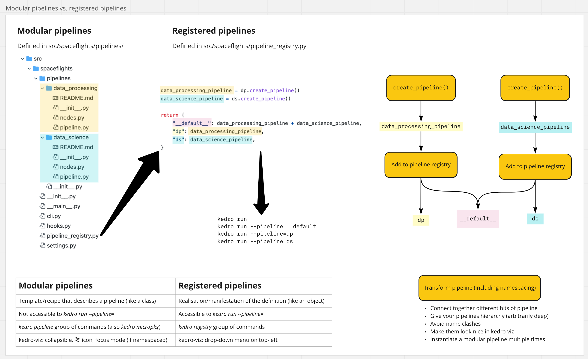

# Refactoring exercise

This repository contains a refactoring exercise based on the standard [spaceflights tutorial described in the Kedro documentation](https://kedro.readthedocs.io/en/stable/tutorial/spaceflights_tutorial.html).

> **Note**
> These materials come from https://github.com/AntonyMilneQB/kedro-university, now archived.
